# 02 python 深入提高

# 异常

## 异常的本质

本质是：当程序出现异常，程序安全的退出、处理完后继续执行的机制。

python中，引进了很多用来描述和处理异常的类，称为异常类。异常类定义中包含了该类异常的信息和对异常进行处理的方法。

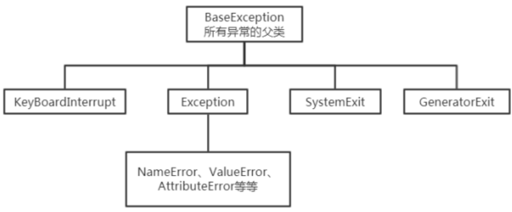

> python中一切都是对象，异常也采用对象的方式来处理。
> 
> 处理过程： 
> 
> 1. 抛出异常：在执行一个方法时，如果发生异常，则这个方法生成代表该异常的一个对象，停止当前执行路径，并把异常对象提交给解释器。 
> 
> 2. 捕获异常：解释器得到该异常后，寻找相应的代码来处理该异常。
> 
> 

## try 和 except 基本结构

`try...except` 是最常见的异常处理结构。结构语法如下：

```Python
try:
    被监控的可能引发异常的语句块
except BaseException [as  e]: # 把捕获到的具体异常信息赋值给变量 e
    异常处理语句
```

> 1. `try`块包含着可能引发异常的代码，`except`块则用来捕捉和处理发生的异常；
> 
> 2. 执行的时候，如果 `try`块中没有引发异常，则跳过 `except`块继续执行后续代码；
> 
> 3. 执行的时候，如果 `try`块中发生了异常，则跳过 `try`块中的后续代码，跳到相应的 `except`块中处理异常；异常处理后，继续执行后续代码。
> 
> 

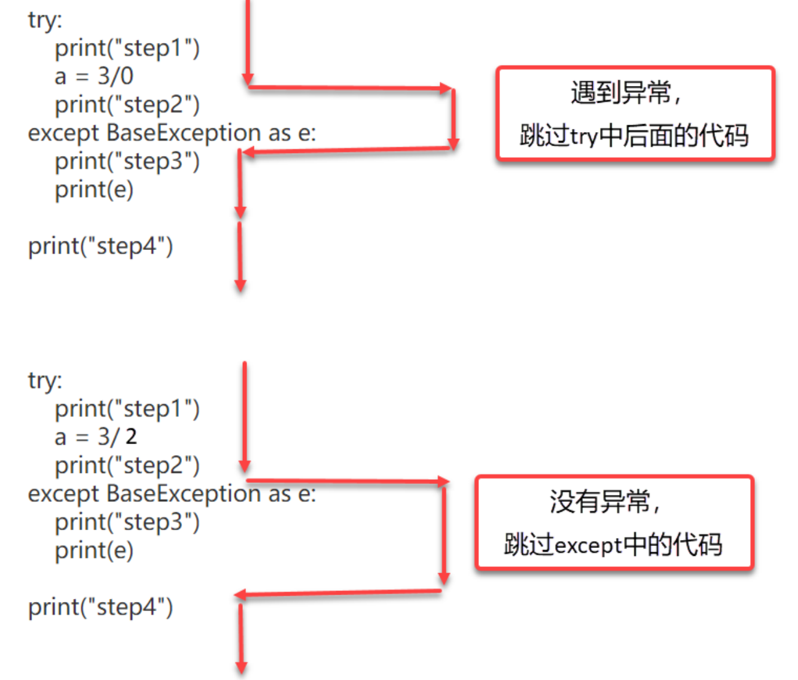

## try\_多个 except 结构

一般建议尽量捕获可能出现的多个异常（按照**先子类后父类的顺序**），并且针对性的写出异常处理代码。为了避免遗漏可能出现的异常，可以在最后增加`BaseException `。结构如下：

```Python
try:
    被监控的、可能引发异常的语句块
except  Exception1:
    处理Exception1的语句块
except  Exception2:
    处理Exception2的语句块
[...]
except  BaseException [as e]:
    处理可能遗漏的异常的语句块
```

```Python
try:
    a = input("请输入被除数：")
    b = input("请输入除数：")
    c = float(a)/float(b)
    print(c)
except ZeroDivisionError:
    print("异常：除数不能为0")
except TypeError:
    print("异常：除数和被除数都应该为数值类型")
except BaseException as e:
    print(e)
    print(type(e))
```

## try\.\.\.except\.\.\.else 结构

`try...except...else` 结构增加了 `else` 块 。

如果 `try` 块中没有抛出异常，则执行 `else` 块。

如果 `try` 块中抛出异常，则执行 `except` 块，不执行 `else` 块。

总之，`else` 中的代码在没有抛出异常的情况下执行。

```Python
try:
    a = input("请输入被除数：")
    b = input("请输入除数：")
    c = float(a)/float(b)
except BaseException as e:
    print(e)
else:
    print("除的结果是：",c)
```

## try\.\.\.except\.\.\.finally 结构

`try...except...finally`结构中， `finally`块**无论是否发生异常都会被执行**；通常用来释放 `try` 块中申请的资源。 

```Python
try:
    f = open("d:/a.txt",'r')
    content = f.readline()
    print(content)
except BaseException as e:
    print(e)
finally:
    f.close()       # 释放资源。此处也可能会发生异常。若发生异常，则程序终止,不会继续往下执行

print("step4")

```

- return 语句和异常处理问题

由于 return 有两种作用：结束方法运行、返回值。

一般不把 return 放到异常处理结构中，而是放到方法最后。

## 常见异常汇总

Python中的异常都派生自 BaseException 类。以下是一些常见的异常。

1. `SyntacError`: 语法错误

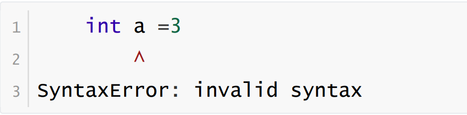

2. `NameError`: 尝试访问一个没有申明的变量


3. `ZeroDivisionError`: 除数为 0 错误


4. `ValueError`: 数值错误

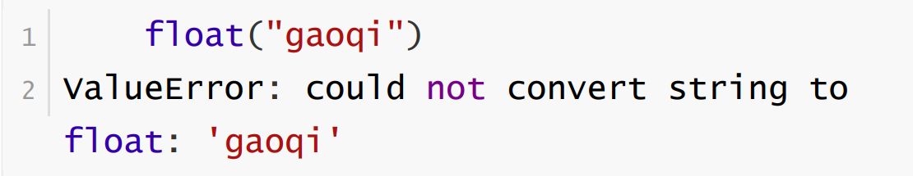

5. `TypeError`: 类型错误

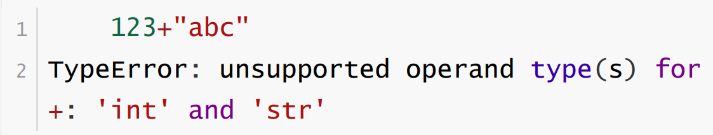

6. `AttributeError`: 访问对象的不存在的属性

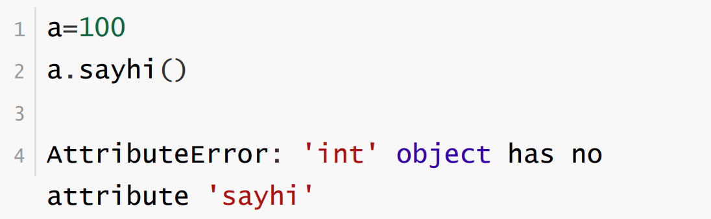

7. `IndexError`: 所以越界异常

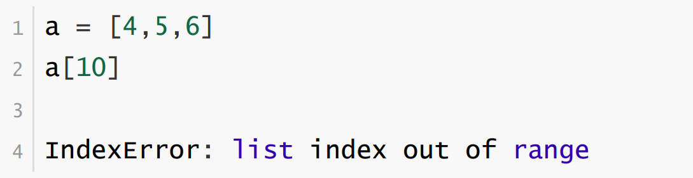

8、`KeyError`: 字典的关键字不存在

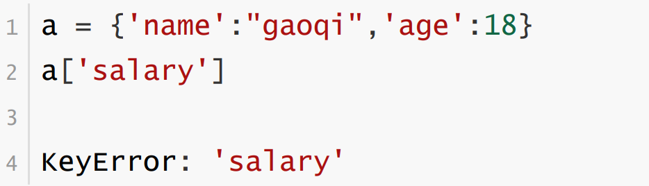

- 常见异常汇总

|异常名称|说明|
|---|---|
|ArithmeticError|所有数值计算错误的基类|
|AssertionError|断言语句失败|
|AttributeError|对象没有这个属性|
|BaseException|所有异常的基类|
|DeprecationWarning|关于被弃用的特征的警告|
|EnvironmentError|操作系统错误的基类|
|EOFError|没有内建输入,到达EOF 标记|
|Exception|常规错误的基类|
|FloatingPointError|浮点计算错误|
|FutureWarning|关于构造将来语义会有改变的警告|
|GeneratorExit|生成器\(generator\)发生异常来通知退出|
|ImportError|导入模块/对象失败|
|IndentationError|缩进错误|
|IndexError|序列中没有此索引\(index\)|
|IOError|输入/输出操作失败|
|KeyboardInterrupt|用户中断执行\(通常是输入^C\)|
|KeyError|映射中没有这个键|
|LookupError|无效数据查询的基类|
|MemoryError|内存溢出错误\(对于Python 解释器不是致命的\)|
|NameError|未声明/初始化对象 \(没有属性\)|
|NotImplementedError|尚未实现的方法|
|OSError|操作系统错误|
|OverflowError|数值运算超出最大限制|
|OverflowWarning|旧的关于自动提升为长整型\(long\)的警告|
|PendingDeprecationWarning|关于特性将会被废弃的警告|
|ReferenceError|弱引用\(Weak reference\)试图访问已经垃圾回收了的对象|
|RuntimeError|一般的运行时错误|
|RuntimeWarning|可疑的运行时行为\(runtime behavior\)的警告|
|StandardError|所有的内建标准异常的基类|
|StopIteration|迭代器没有更多的值|
|SyntaxError|Python 语法错误|
|SyntaxWarning|可疑的语法的警告|
|SystemError|一般的解释器系统错误|
|SystemExit|解释器请求退出|
|TabError|Tab 和空格混用|
|TypeError|对类型无效的操作|
|UnboundLocalError|访问未初始化的本地变量|
|UnicodeDecodeError|Unicode 解码时的错误|
|UnicodeEncodeError|Unicode 编码时错误|
|UnicodeError|Unicode 相关的错误|
|UnicodeTranslateError|Unicode 转换时错误|
|UserWarning|用户代码生成的警告|
|ValueError|传入无效的参数|
|Warning|警告的基类|
|WindowsError|系统调用失败|
|ZeroDivisionError|除\(或取模\)零 \(所有数据类型\)|

## with 上下文管理

`finally`块由于是否发生异常都会执行，通常我们放释放资源的代码。 其实，可以通过 `with`上下文管理，更方便的实现释放资源的操作。

with 上下文管理的语法结构如下：

```Python
with context_expr [ as  var]:
    语句块
```

> `with`上下文管理可以自动管理资源，在 `with`代码块**执行完毕后自动还原进入该代码之前的现场或上下文**。不论何种原因跳出 `with` 块，不论是否有异常，**总能保证资源正常释放**。极大的简化了工作，在**文件操作、网络通信**相关的场合非常常用。
> 
> 

```Python
with open('./a.txt', 'r') as f:
    for line in f:
        print(line) # 输出文件中的每一行内容
```

## Traceback 模块和生成异常日志

```Python
import traceback

try:
    print("step1")
    a = 1 / 0
except BaseException as e:
    print(e)
    with open("error.log", "a") as f:
        traceback.print_exc(file=f)  # 将异常信息写入 error.log 文件
```

## 自定义异常类

程序开发中，有时候需要自定义异常类。

自定义异常类一般都是运行时异常，通常**继承 Exception 或 子类** 即可。

命名一般以 **Error 和 Exception 为后缀**。

自定义异常**由 raise 语句主动抛出**。

```Python
class AgeError(Exception): # 继承 Exception
    def __init__(self, errorInfo):
        '''
            super().__init__(errorInfo)
            1. 让父类保存异常信息到 e.args
            2. 让默认的 str(e) 能输出异常信息
        '''
        super().__init__(errorInfo) # 调用父类的构造方法
        self.errorInfo = errorInfo # 保存错误信息

    def __str__(self):
        return f'AgeError: {self.errorInfo}, age is invalid' # 返回错误信息

if __name__ == '__main__': #如果为True，则模 块是作为独立文件运行，可以执行测试代码
    age = int(input("请输入年龄: "))
    try:
        if age < 0 or age > 120:
            raise AgeError("年龄必须在0到120之间") # 抛出自定义异常
        else:
            print(f"年龄输入正确: {age}")
    except AgeError as e:
        print(e) # 捕获自定义异常并输出错误信息
```

# 文件操作

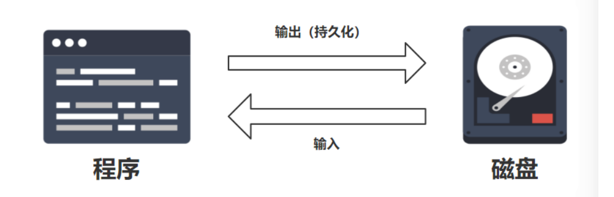

## **file文件操作\_操作系统底层关系\_写入文件**

1. 文本文件和二进制文件

按文件中数据组织形式，我们把文件分为**文本文件和二进制文件**两大类。 

> 1. 文本文件
> 
> 文本文件存储的是普通“字符”文本，python 默认为 unicode 字符集 （两个字节表示一个字符，最多可以表示：65536个），可以使用记事本等文本程序打开。
> 
> 2. 二进制文件
> 
> 二进制文件把数据内容用“字节”进行存储，无法用记事本打开。必须使用专用的软件解码。常见的有：MP4视频文件、MP3音频文件、JPG图片、doc文档等等。
> 
> 

2. 文件操作相关模块概述

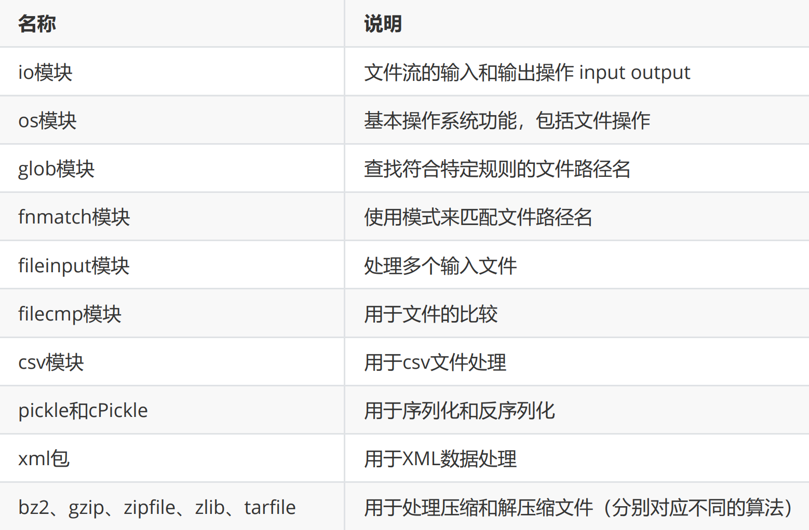

3. 创建文件对象 open\(\)

`open()` 函数用于创建文件对象，基本语法格式如下：

`open(文件名 [, 打开方式])`如果只是文件名，代表在当前目录下的文件。

文件名可以是相对路径和绝对路径。为了减少路径分隔符（windows 中是 \\\\\)，可以使用**原始字符串**：`r"D:\b.txt"`。

打开方式有如下集中：

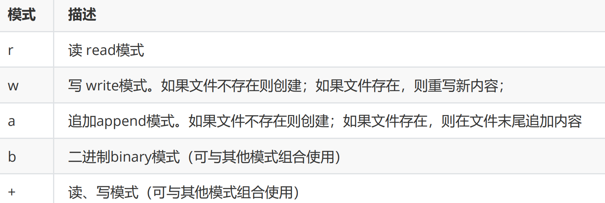

> 文本文件对象和二进制文件对象的创建：
> 
> 1. 如果没有增加模式 b ，则默认创建的是文本文件对象，处理的基本单元是“字符”。 
> 
> 2. 如果是二进制模式 b ，则创建的是二进制文件对象，处理的基本单元是“字节”。
> 
> 

4. 文本文件的写入

文本文件的写入一般就是三个步骤：

`创建文件对象 -> 写入数据 -> 关闭文件对象`

```Python
with open(r'a.txt', 'w') as f:
    s = 'hello world'
    f.write(s)
```

## 中文乱码问题

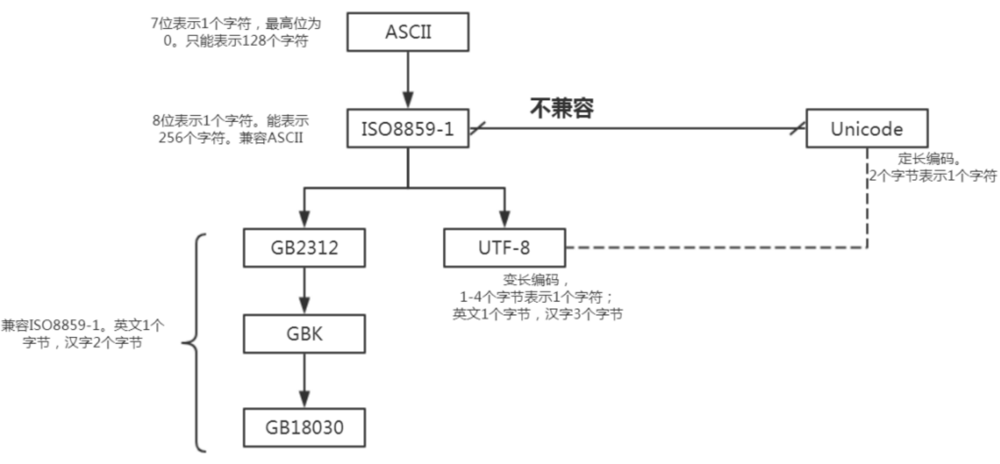

1. ASCII

全称为 `American Standard Code for Information Interchange` ，美国信息交换标准代 码，这是世界上最早最通用的单字节编码系统，主要用来显示现代 英语及其他西欧语言。

2. GBK 

全称为 `Chinese Internal Code Specification` ，即汉字内码扩展规范，于1995年制定。它主要是扩展了 GB2312 ，在它的基础上又加了更多的汉字， 它一共收录了21003个汉字。

3. Unicode

`Unicode` 编码设计成了`固定两个字节`，所有的字符都用16位 \(2^16=65536\)表示，包括之前只占8位的英文字符等，所以会造成空间的浪费， UNICODE 在很长的一段时间内都没有得到推广应用。 

`Unicode` 完全重新设计，不兼容 iso8859\-1 ，也不兼容任何其他编码。

4. UTF\-8

对于英文字母， unicode 也需要两个字节来表示。所以 unicode 不便于传输和存储。因此而产生了 `UTF编码` ， UTF\-8 全称是（ 8\-bit Unicode Transformation Format ）。 

一般项目都会使用 UTF\-8 。

- 中文乱码问题

`windows` 操作系统默认的编码是 `GBK` ， Linux 操作系统默认的编码是 `UTF8` 。当用 open\(\) 时，调用的是操作系统打开的文件，默认的编码是 `GBK`

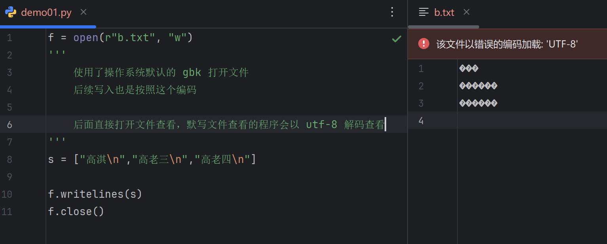

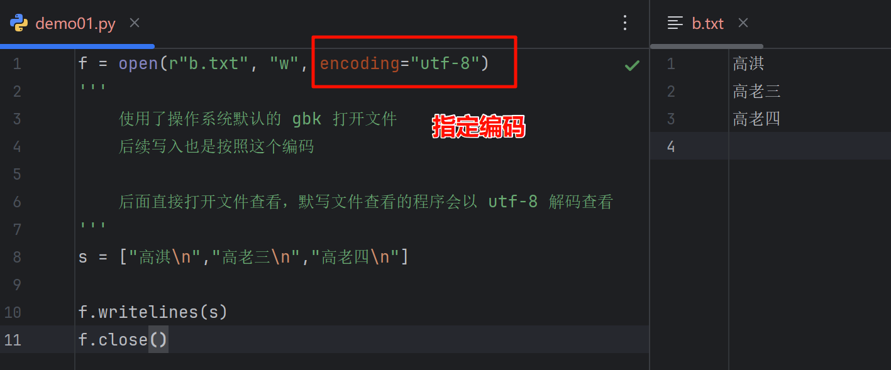

- write\(\) / writelines\(\) 写入数据

> `write(s)` : 把字符串 s 写入到文件中
> 
> `writelines(s)` : 把字符串列表写入文件中，不会主动添加换行符
> 
> 

```Python
f = open(r"d:\bb.txt","w",encoding="utf-8")
s = ["高淇\n","高老三\n","高老四\n"]

f.writelines(s)
f.close()
```

## 文件关闭流

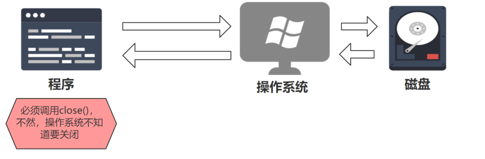

由于文件底层是由操作系统控制，所以打开的文件对象必须显式调用 `close()` 方法关闭文件对象。当调用 `close()` 方法时，**首先会把缓冲区数据写入文件\(也可以直接调用 flush\(\) 方法\)，再关闭文件，释放文件对象**。

为了确保打开的文件对象正常关闭，**一般结合异常机制的 finally 或者 with 关键字实现无论何种情况都能关闭打开的文件对象**。

`with关键字` （上下文管理器）可以**自动管理上下文资源**，不论什么原因跳出 with块 ，都能确保文件正确的关闭，并且可以在代码块执行完毕后自动还原进入该代码块时的现场。

```Python
# 1、使用 try...except...finally
try:
    f = open("test.txt","w")
    f.write("hello world")
except BaseException as e:
    print(e)
finally:
    f.close()
 
 # 2、使用 with 上下文管理器 
with open("test.txt","w") as f:
    f.write("hello world")
```

## 文本文件的读取

文件的读取一般使用如下三个方法：

> 1. read\(\[size\]\)
> 
> 从文件中读取 size 个字符，并作为结果返回。
> 
> 如果没有 size 参数，则读取整个文件。 读取到文件末尾，会返回空字符串。
> 
> 2. readline\(\)
> 
> 读取一行内容作为结果返回。读取到文件末尾，会返回空字符串。
> 
> 3. readlines\(\)
> 
> 文本文件中，每一行作为一个字符串存入列表，返回该列表。
> 
> 

1. 操作1：读取一个文件前 n 个字符

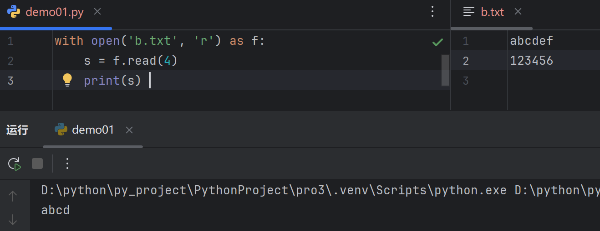

2. 操作2：文件较小，一次将文件内容读入程序中

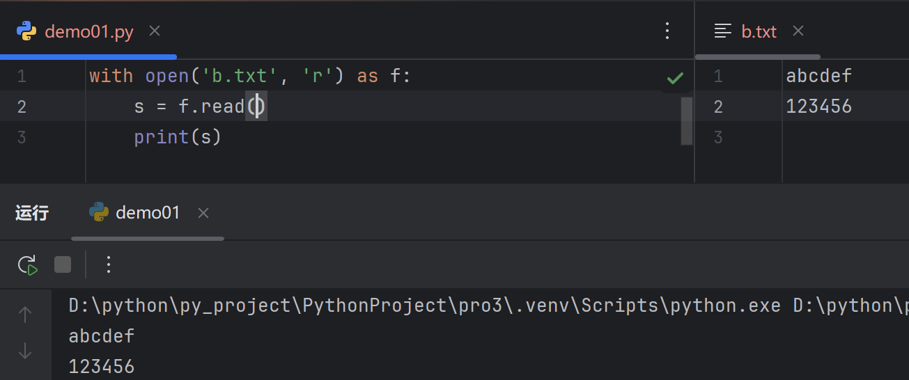

3. 操作3：按行读取一个文件

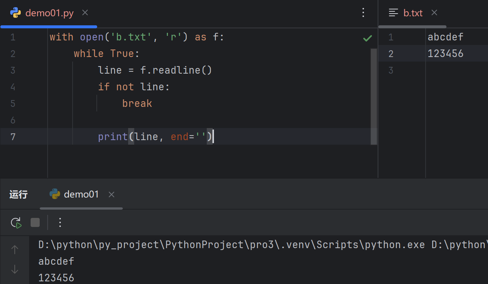

4. 使用迭代器（每次返回一行）读取文本文件

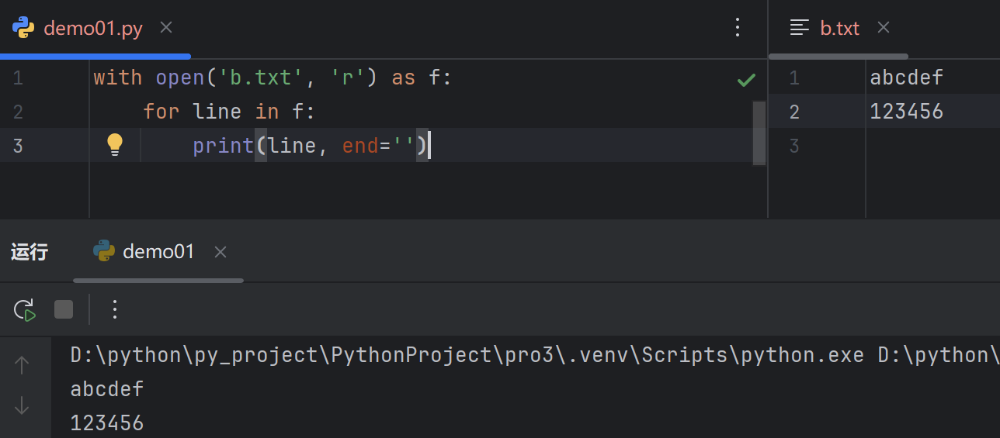

5. 为文本文件的每一行的行首增加行号

```Python
with open("b.txt", 'r', encoding='utf-8') as f:
    lines = f.readlines()
    
    lines2 = ['{0}\t{1}'.format(index, line) for index, line in zip(range(1, len(lines) + 1), lines)]


with open("bx.txt", 'w', encoding='utf-8') as f:
    f.writelines(lines2)
```

## 二进制文件读写\_文件拷贝

二进制文件的处理流程和文本文件流程一致。首先还是要创建文件 对象，不过，我们需要指定二进制模式，从而创建出二进制文件对 象。例如： 

> `f = open(r"d:\a.txt", 'wb')` \# 可写的、重写模式的二进制文件对象 
> 
> `f = open(r"d:\a.txt", 'ab')` \# 可写的、追加模式的二进制文件对象 
> 
> `f = open(r"d:\a.txt", 'rb')` \# 可读的二进制文件对象
> 
> 

创建好二进制文件对象后，**仍然可以使用 write\(\) 、 read\(\) 实现文件的读写操作**。

```Python
with open('log.png', 'r') as srcFile, open('log2.txt', 'w') as dstFile:
    for line in srcFile:
        dstFile.write(line)
```

## 文件对象的常用属性和方法\_文件任意位置操作

文件对象封装了文件相关的操作。

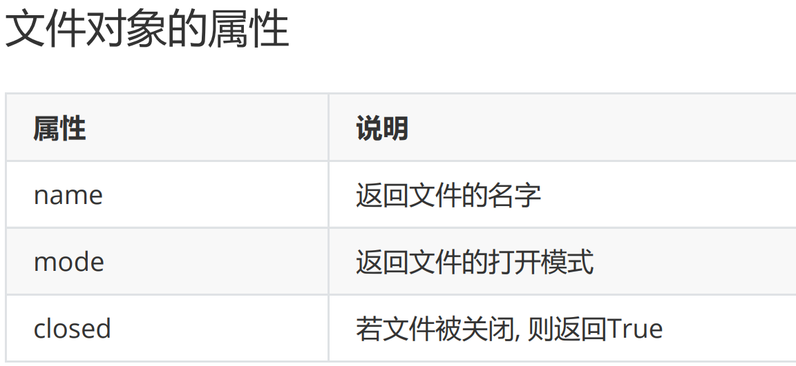

```Python
with open('b.txt', 'w') as f:
    print('file.name =', f.name) # file.name = b.txt
    print('file.mode =', f.mode) # file.mode = w
    print('file.closed =', f.closed) # file.closed = False
```

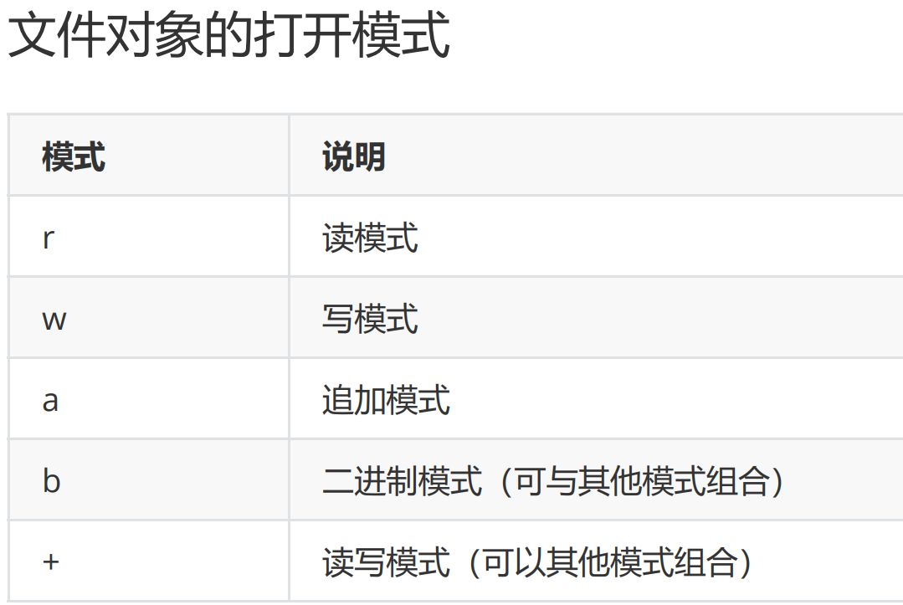

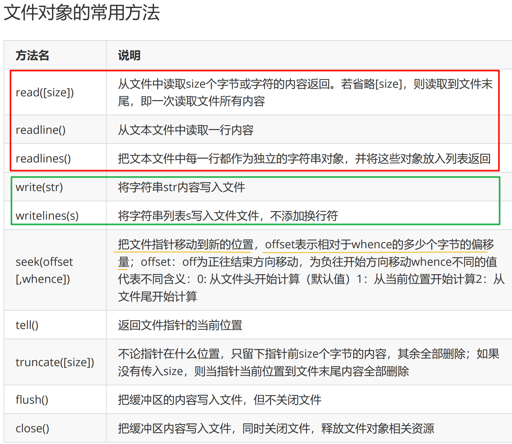

```Python
# 文件内容
with open('b.txt', 'r', encoding='utf-8') as f:
    print(f.tell()) # 0
    print("读取的内容是 = {0}".format(str(f.readline()))) # 读取的内容是 = abcdef
    print(f.tell()) # 6
    f.seek(3, 0) # 相对文件开头偏移3个位置
    print("读取的内容是 = {0}".format(str(f.readline()))) # 读取的内容是 = def
```

## 使用 pickle 序列化和反序列化

序列化：将对象转化成“串行化”数据形式，存储到硬盘或通过网络传输到其他地方。

反序列化：是指相反的过程，将读取到的“串行化数据”转化成对象。 

可以使用`pickle`模块中的函数，实现序列化和反序列操作。

> Python中，一切皆对象，对象本质上就是一个“存储数据的内存块”。有时候，需要将“内存块的数据”保存到硬盘上，或者通过网络传输到其他的计算机上。这时候，就需要“对象的序列化和反序列化”。 
> 
> 对象的序列化机制广泛的应用在分布式、并行系统上。
> 
> 

> 序列化和反序列化：
> 
> - pickle\.dump\(obj, file\) obj 就是要被序列化的对象， file 指的是存储的文件
> 
> - pickle\.load\(file\) 从 file 读取数据，反序列化成对象
> 
> 

```Python
import pickle

with open('data.dat', 'wb') as f:
    data = {
        "name": "python语言",
        "age": 22,
        "scores": {
            "语文": 97,
            "数学": 98,
            "英语": 99
        }
    }
    pickle.dump(data, f)
    
with open('data.dat', 'rb') as f:
    data = pickle.load(f)
    print(data)
```

## CSV 文件操作

csv是逗号分隔符文本格式，常用于数据交换、Excel文件和数据库数据的导入和导出。

> 与Excel文件不同，CSV文件中：
> 
> - 值没有类型，**所有值都是字符串**
> 
> - 不能指定字体颜色等样式
> 
> - 不能指定单元格的宽高，不能合并单元格
> 
> - 没有多个工作表
> 
> - 不能嵌入图像图表 
> 
> 

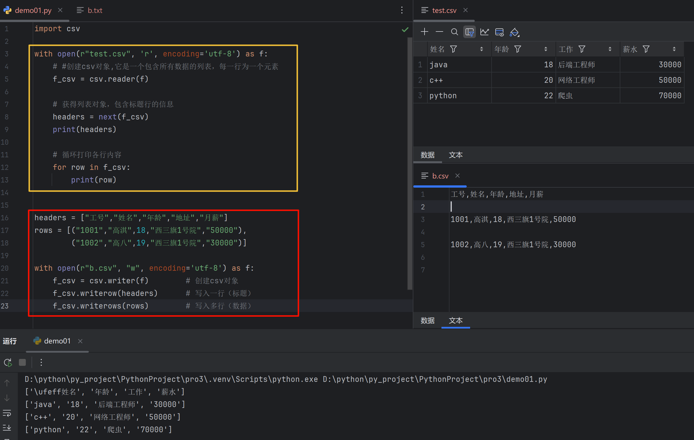

## os 模块调用系统可执行命令

- `os.system` 可以帮助直接调用系统的命令。

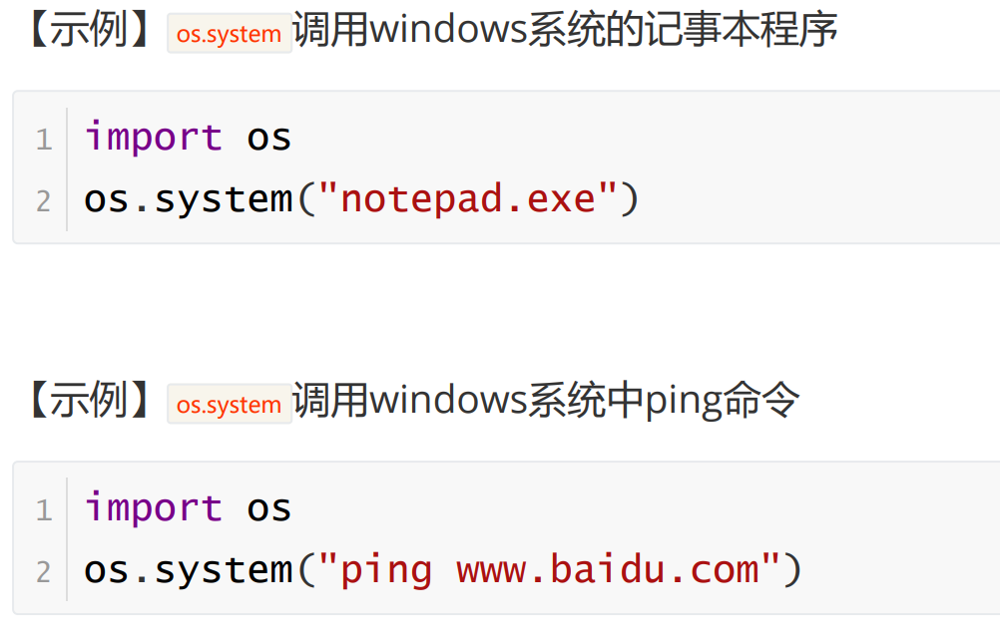

- `os.startfile` 可以直接调用可执行程序

```Python
import os

os.startfile(r"C:\Program Files (x86)\Tencent\WeChat\WeChat.exe")
```

## os 模块文件和目录操作

可以通过前面讲的文件对象实现对于文件内容的读写操作。如果，还需要对文件和目录做其他操作，可以使用 os 和 os\.path 模块。

os 模块操作文件、目录本身，而不是对文件内容操作。

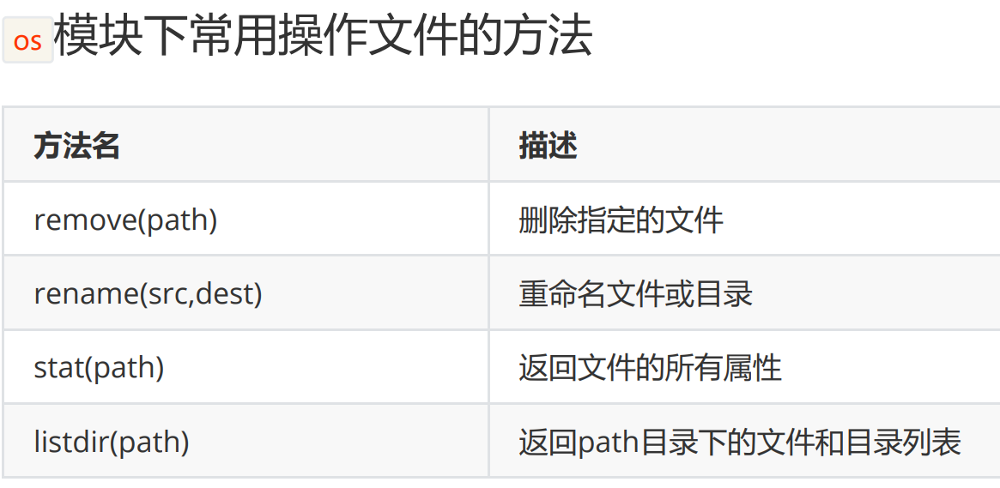

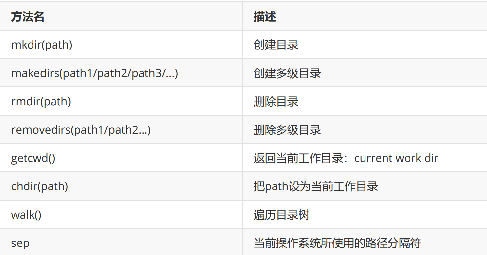

```Python
import os

print(os.name) # windows -> nt   linux -> posix
print(os.sep) # windows -> \   linux -> /
print(repr(os.linesep)) # windows -> '\r\n'  linux -> \n

a = '3'
print(a)
print(repr(a)) # repr 可以显示数据信息

# 获取文件和文件夹的相关信息
print(os.stat("b.txt"))

print(os.getcwd())   # 获得当前工作目录
os.chdir("D:\\")       # 当前的工作目录就变成了d：的根目录
print(os.getcwd())   # 获得当前工作目录

dirs = os.listdir("D:\\") 
print(dirs) 
```

## os\.path 模块

os\.path 模块判断文件和目录的路径。

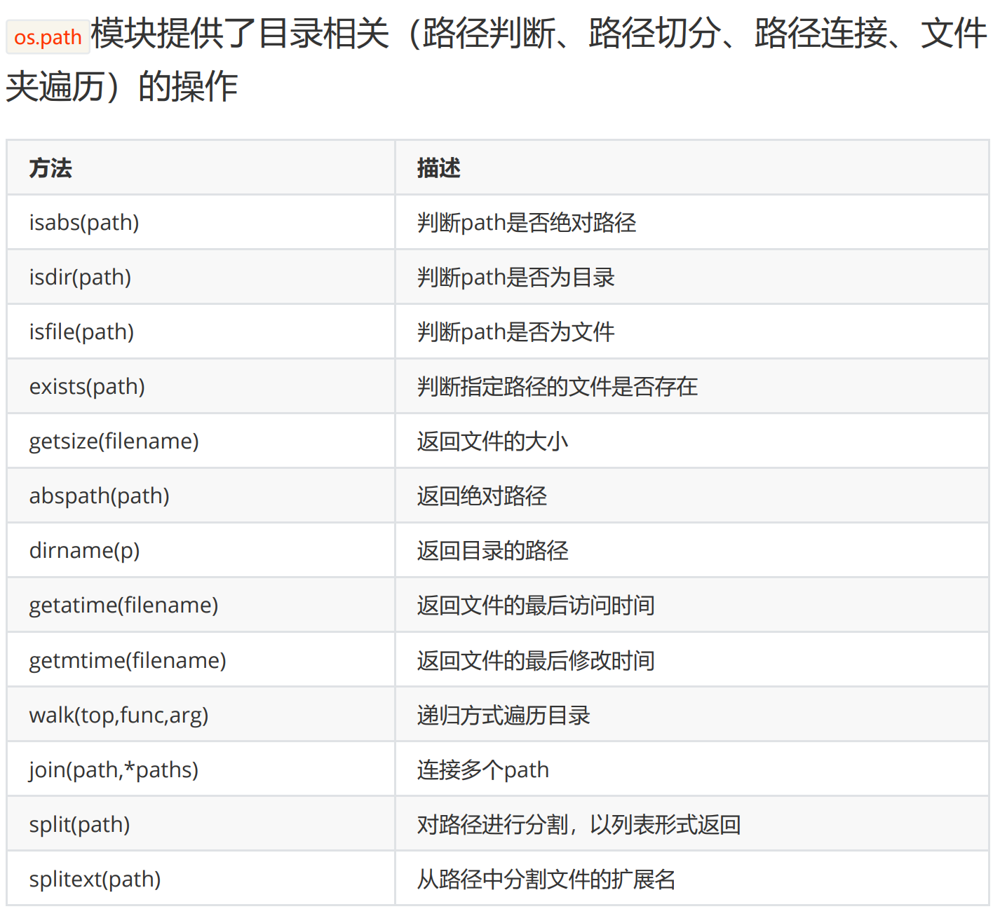

```Python
import os
import os.path
################# 获得目录、文件基本信息 ######################
print(os.path.isabs("d:/a.txt"))    #是否绝对路径
print(os.path.isdir("d:/a.txt"))    #是否目录
print(os.path.isfile("d:/a.txt"))   #是否文件
print(os.path.exists("a.txt"))      #文件是否存在
print(os.path.getsize("a.txt"))     #文件大小
print(os.path.abspath("a.txt"))     #输出绝对路径
print(os.path.dirname("d:/a.txt"))  #输出所在目录

######## 获得创建时间、访问时间、最后修改时间 ##########
print(os.path.getctime("a.txt"))    #返回创建时间
print(os.path.getatime("a.txt"))    #返回最后访问时间
print(os.path.getmtime("a.txt"))    #返回最后修改时间

################ 对路径进行分割、连接操作 ####################
path = os.path.abspath("a.txt")     #返回绝对路径

print(os.path.splitext(path))       #返回元组：路径、扩展名
# ('C:\\Users\\Administrator\\PycharmProjects\\mypro_io\\test_os\\a', '.txt')

print(os.path.join("aa","bb","cc")) #返回路径：aa/bb/cc
```

- 列出指定目录下所有的 \.py 文件，并输出文件名

```Python
import os
import os.path

path = os.getcwd()
files = os.listdir(path)

# 1、通过字符串查找 py 判断
for file in files:
    pos = file.rfind('.')
    if file[pos + 1:] == 'py': # 获取扩展名，如果是 py 就输出
        print(file, end = '\t')

print()

# 2、直接用 endswith 函数判断
files = [file for file in files if file.endswith('.py')]
for file in files:
    print(file, end = '\t')
```

## walk\(\) 递归遍历所有文件和目录

os\.walk\(\) 方法是一个简单易用的文件、目录遍历器，可以帮助我们高效的处理文件、目录方面的事情。格式如下：

`os.walk(top[, topdown=True[, onerror=None[, followlinks=False]]])`

其中， top: 是要遍历的目录。topdown: 可选，True，遍历 top 目录再遍历子目录。返回三元组（ root 、 dirs 、 files \):

root ：当前正在遍历的文件夹本身

dirs ：一个列表，该文件夹中所有的目录的名字 

files ：一个列表，该文件夹中所有的文件的名字

```Python
import os.path

path = os.getcwd()
content = os.walk(path, topdown=False)

for root, dirs, files in content:
    for name in files:
        print(os.path.join(root, name))
    for name in dirs:
        print(os.path.join(root, name))
```

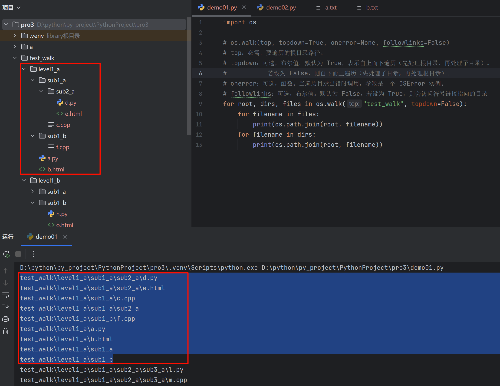

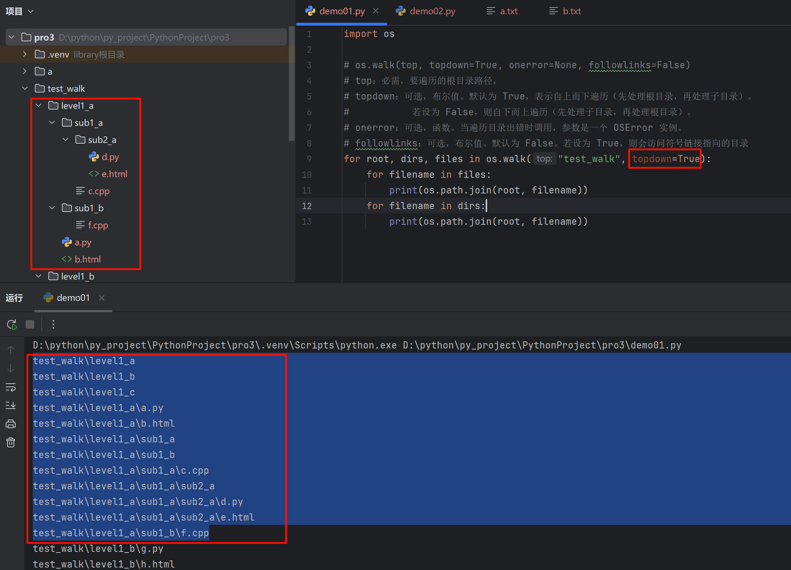

## shutil 模块（拷贝和压缩）

shutil 模块是python标准库中提供的，主要用来做文件和文件夹的拷贝、移动、删除等；还**可以做文件和文件夹的压缩、解压缩操作**。

os 模块提供了对目录或文件的一般操作。 **shutil 模块作为补充**，提供了移动、复制、压缩、解压等操作，这些 os 模块都没有提供。

```Python
import shutil 

# copy文件内容 
shutil.copyfile("a.txt","a_copy.txt")
```

```Python
import shutil

# "音乐"文件夹不存在才能用。
# 将文件夹“电影/学习”下面的内容拷贝到文件夹“音乐”下。
# 拷贝时忽略所有的 html 和 htm 文件。
shutil.copytree("电影/学习", "音乐", ignore=shutil.ignore_patterns("*.html", "*.htm"))
```

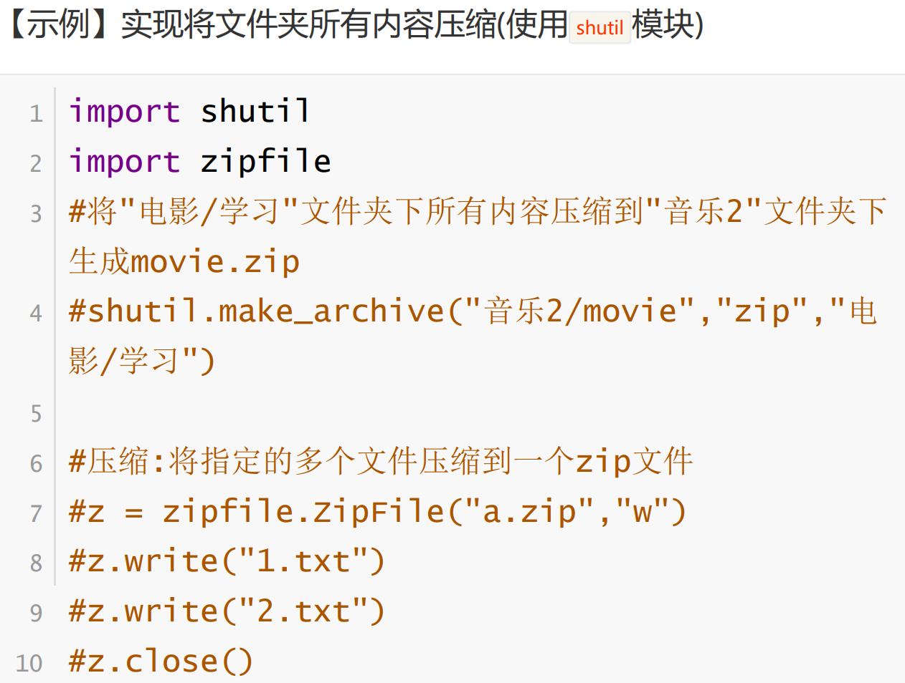

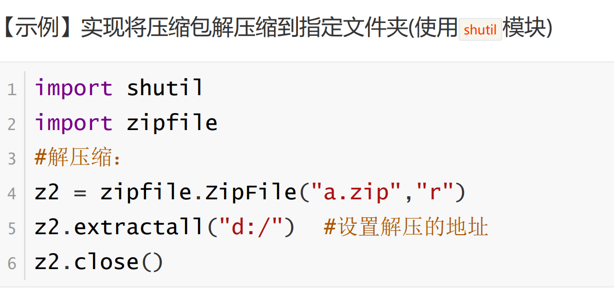

## 递归遍历目录下的所有文件和目录

```Python
import os
import os.path

# 递归遍历目录树
def my_print_file(path, level):
    child_files = os.listdir(path)
    for file in child_files:
        file_path = os.path.join(path, file)
        print("\t" * level + file_path[file_path.rfind(os.sep) + 1:])
        if os.path.isdir(file_path):
            my_print_file(file_path, level + 1)

my_print_file("D:\\", 0)
```

# 模块

## **模块化编程理念\_什么是模块\_哲学思想**

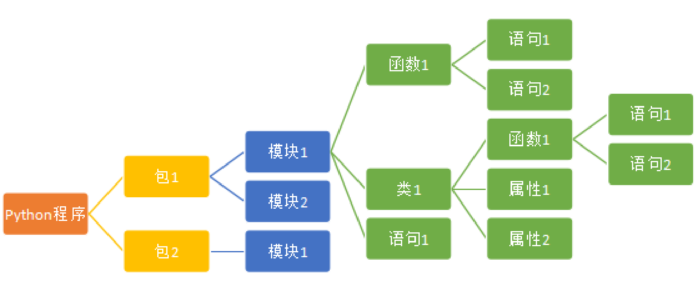

> 1. Python程序由模块组成。一个模块对应python源文件，一般后缀名是: `.py`
> 
> 2. 模块由语句组成。运行Python程序时，按照模块中语句的顺序依次执行
> 
> 3. 语句是Python程序的构造单元，用于创建对象、变量赋值、调用函数、控制语句等
> 
> 

- 标准库模块（standard library\)

与函数类似，模块也分为标准库模块和用户自定义模块。 

Python标准库提供了操作系统功能、网络通信、文本处理、文件处理、数学运算等基本的功能。比如：random\(随机数\)、math\(数学 运算\)、time\(时间处理\)、file\(文件处理\)、os\(和操作系统交互\)、 sys\(和解释器交互\)等。 

另外，Python还提供了海量的第三方模块，使用方式和标准库类似。功能覆盖了我们能想象到的所有领域，比如：科学计算、WEB 开发、大数据、人工智能、图形系统等。

- 为什么需要模块化编程

模块\(module\)对应于Python源代码文件\(\.py文件\)。模块中可以定义变量、函数、类、普通语句。 这样，我们可以将一个Python程序分解成多个模块，便于后期的重复应用。 

模块化编程（Modular Programming）将一个任务分解成多个模块。每个模块就像一个积木一样，便于后期的反复使用、反复搭建。 模块化编程有以下优势：

1. 便于将一个任务分解成多个模块，实现团队协同开发，完成大规模程序

2. 实现代码复用。一个模块实现后，可以被反复调用

3. 可维护性增强

## 模块化编程的流程\_设计和实现的分离思想

1. 模块化编程的一般流程

> 1. 设计API，进行功能描述
> 
> 2. 编码实现API中描述的功能
> 
> 3. 在模块中编写测试代码，并消除全局代码
> 
> 4. 使用私有函数实现不被外部客户端调用的模块函数
> 
> 

2. 模块的API和功能描述要点

API\(Application Programming Interface 应用程序编程接口\)是用于描述模块中提供的函数和类的功能描述和使用方式描述。

模块化编程中，首先设计的就是模块的API（即要实现的功能描述），然后开始编码实现API中描述的功能。最后，在其他模块中导入本模块进行调用。

可以通过 `help(模块名)` 查看模块的API。一般使用时先导入模块 然后通过 `help` 函数查看。 

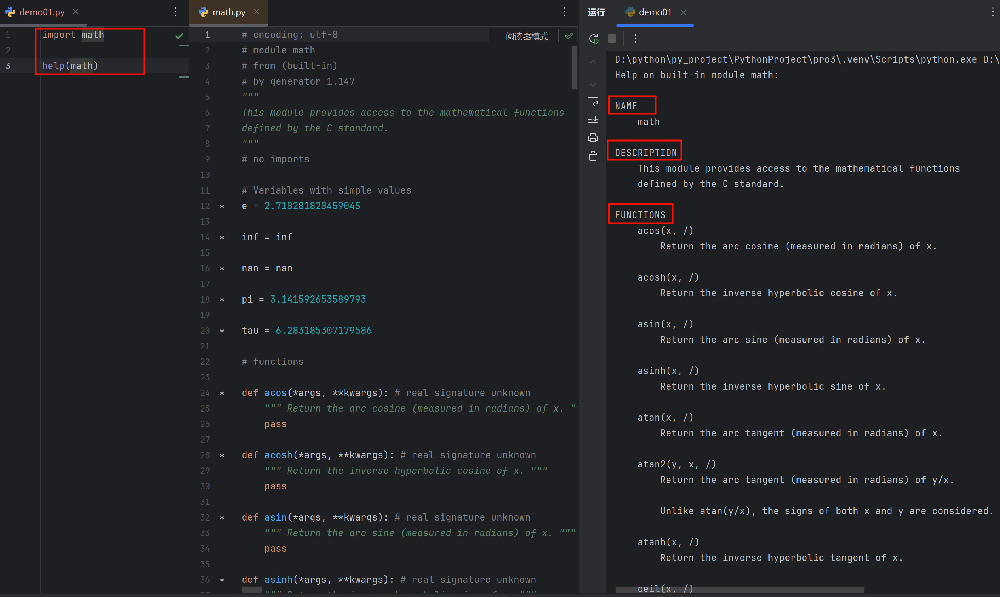

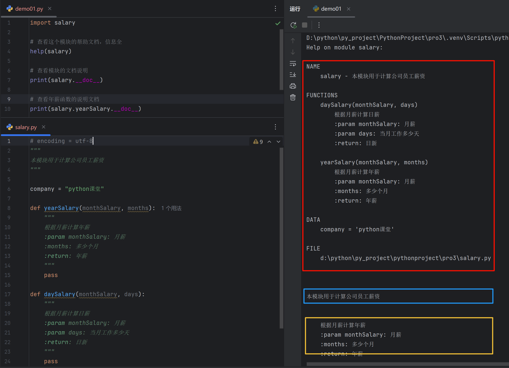

- 通过 `__name == "__main__"` 独立处理模块的测试代码

```Python
# encoding = utf-8
*"""*
*本模块用于计算公司员工薪资*
*"""*

company = "python课堂"

def yearSalary(monthSalary, months):
    *"""*
*    根据月薪计算年薪*
*    :param monthSalary: 月薪*
*    :months: 多少个月*
*    :return: 年薪*
*    """*
*    *return monthSalary * months

def daySalary(monthSalary, days):
    *"""*
*    根据月薪计算日薪*
*    :param monthSalary: 月薪*
*    :param days: 当月工作多少天*
*    :return: 日新*
*    """*
*    *return monthSalary / days

'''
    __name__: 是一个内置的特殊变量（也称为“魔术变量”），用于表示当前模块的名称。
              而 __main__ 是 Python 顶层执行环境的名称。
     
    __name__ 取值规则：
        1、当 Python 文件被直接运行（比如 python salary.py）时，该模块的 __name__ 会被自动赋值为字符串 '__main__'。
        2、当 Python 文件被作为模块导入（比如 import salary）时，该模块的 __name__ 会被赋值为模块名（即文件名去掉 .py 后缀，如 'salary'）。

    if __name__ == '__main__': 的作用：
        判断当前模块是否正在被直接执行，而不是被导入到其他模块中。
        这样可以在模块做本模块的测试代码
        
        如果条件成立（即直接运行），则执行该代码块内的语句。
        如果条件不成立（即被导入），则跳过该代码块，避免在执行 import 时产生意外副作用（例如执行测试、启动程序等）。
'''
if __name__ == '__main__':
    print(yearSalary(20000, 16)) # 如果是在 salary 模块运行，就会执行这里面的语句
```

在正常情况下，模块名字对应源文件名。 仅有一个例外，就是当一 个模块被作为程序入口时（主程序、交互式提示符下），它的 `__name__` 的值为 `__main__`。我们可以根据这个特点，将模块源代码文件中的测试代码进行独立的处理。

## 模块导入

模块化设计的好处之一就是“代码复用性高”。写好的模块可以被反复调用，重复使用。模块的导入就是“在本模块中使用其他模块”。

### import 语句导入模块

- `import` 语句的基本格式如下：

```Python
import 模块名               #导入一个模块
import 模块1, 模块2 [,...]  #导入多个模块
import 模块名 as 模块别名   #导入模块并使用新名字
```

- import 加载的模块分为四种类型

> 1. 使用python编写的代码 \.py 文件
> 
> 2. 已被编译为共享库或 DLL 的C或C\+\+扩展
> 
> 3. 一组模块的包
> 
> 4. 使用C编写并链接到python解释器的内置模块
> 
> 

一般通过 `import` 语句实现模块的导入和使用，import 本质上是使用了内置函数 `__import__()`。

通过 `import` 导入一个模块时，python解释器进行执行，最终会生成一个对象，这个对象就代表了被加载的模块。

```Python
import salary
import math

# 1、导入自定义模块
print(salary) # <module 'salary' from 'D:\\python\\py_project\\PythonProject\\pro3\\salary.py'>
print(id(salary)) # 1982533865776
print(type(salary)) # <class 'module'>

# 2、导入标准库模块
print(math) # <module 'math' (built-in)>
print(id(math)) # 1982533868496
print(type(math)) # <class 'module'>
```

由上述代码可以看到 `math模块` 被加载后，实际会生成一个 `module` 类的对象，该对象被 `math` 变量引用。可以通过 math 变量引用模块中所有的内容。

可以通过 import 导入多个模块，本质上也是生成多个 module 类的对象而已。

有时候，需要给模块起一个别名，本质上，这个别名仅仅是新创建一个变量引用加载的模块对象而已。使用 `as` 即可起一个别名。

```Python
import math as m

'''
    import math as m
    相当于
    import math
    m = math 
    math 不能再被使用，必须使用 m 别名
'''
print(m.e)
```

### from\.\.\.import 导入

python中可以使用 `from...import` 导入模块中的成员。基本语法：

`from 模块名 import 成员1, 成员2, ...`

如果需要导入一个模块中的所有成员，可以：`from 模块名 import *`

> 尽量避免 `from 模块名 import *` 这种写法。\* 表示导入模块中所有的不是以下划线 \_ 开头的名字都导入到当前位置。但是不知道导入了什么名字，很有可能覆盖已经定义的名字。而且可读性极差，生产环境禁止使用。
> 
> 

```Python
from math import pi, sin

print(sin(pi / 2))

# print(math.e) # 不能使用其它成员，NameError: name 'math' is not defined
```

### import语句和from\.\.\.import语句的区别

`import` 导入的是模块。 `from...import` 导入的是模块中的函数/类。

```Python
import salary

print(salary.yearSalary(20000, 16)) # 需要使用模块名引用其中的内容
```

```Python
from salary import *

print(yearSalary(20000, 16)) # 直接使用 salary 模块中的函数
```

### \_\_import\_\_\(\) 动态导入

`import` 语句本质上就是调用内置函数 `__import__()` ，可以通过它实现动态导入。给 \_\_import\_\_\(\) 动态传递不同的参数值，就能导入不同的模块。

```Python
s = "math"

m = __import__(s) # 导入后生成的模块对象的引用给变量 m

print(m.sin(m.pi / 2))
```

一般不建议我们自行使用 `__import__()` 导入，其行为在python2 和python3中有差异，会导致意外错误。`如果需要动态导入可以使用 importlib 模块`。

```Python
import importlib

# 动态导入 salary 模块
m = importlib.import_module('salary')

print(m.yearSalary(20000, 16))
```

### 模块的加载问题

当导入一个模块时，模块中的代码都会被执行。不过，如果再次导入这个模块，则不会再次执行。

一个模块无论导入多少次，这个模块在整个解释器进程内有且仅有一个实例对象。

有的时候确实需要重新加载一个模块，这时候可以使用：`importlib.reload()` 方法：

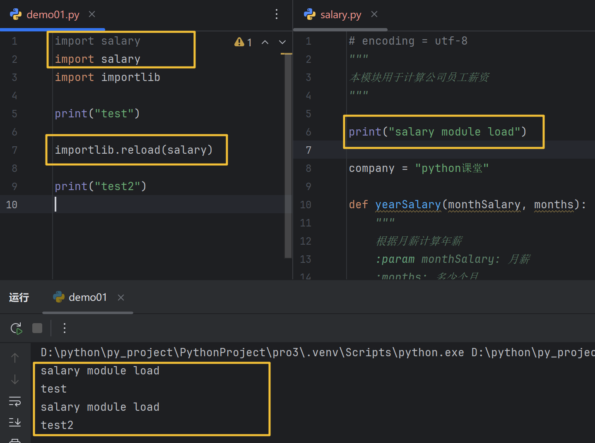

## 包 package 的使用

### 包的概念和结构

当一个项目中有很多个模块时，需要再进行组织。我们将功能类似的模块放到一起，形成了“包”。本质上，`“包”就是一个必须有 __init__.py 的文件夹`。典型结构如下： 

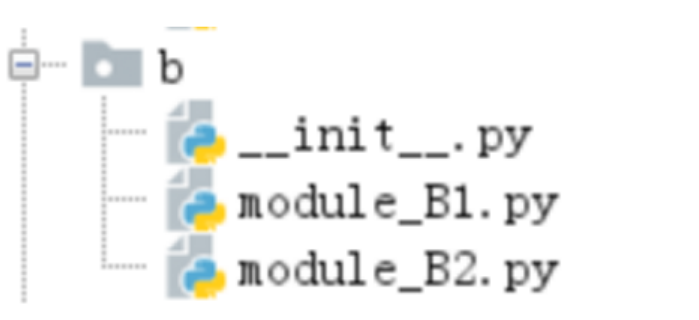

包下面可以包含模块module，也可以再包含子包subpackage。

下图中，a 是上层包，下面有一个子包 aa。每个包里面都有 `__init__.py` 文件。

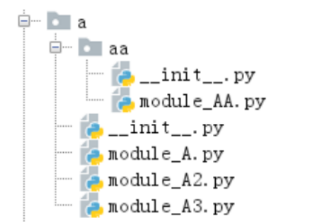

### Pycharm 中创建包

在 pycharm 开发环境中创建包：右键项目 \-\> new \-\> python package 输入包名，就会创建这个包，`__init__.py` 文件会自动创建。 

### 导入包操作和本质

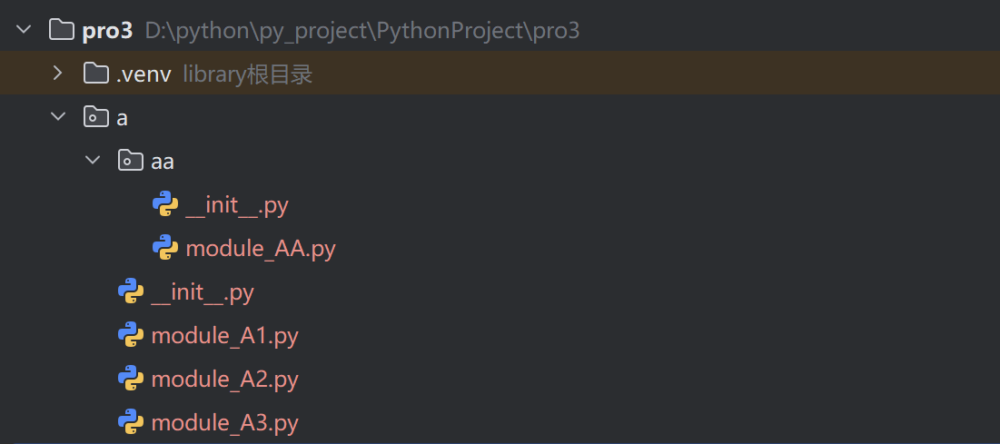

> 1. `import a.aa.module_AA`
> 
> 在使用时，必须加完整名称来引用，比如 `a.aa.module_AA.fun_AA()`
> 
> 2. `from a.aa import module_AA`
> 
> 在使用时，可以直接使用模块名，比如 `module_AA.fun_AA()`
> 
> 3. `from a.aa.module_AA import fun_AA` 直接导入函数
> 
> 在使用时，直接可以使用函数名。比如 `fun_AA()`
> 
> 

> 1. `from package import item` 这种语法中，item 可以是包、模块、，也可以是函数、类、变量
> 
> 2. `import item1, item2` 这种语法中，item 必须是包或者模块，不能是其他
> 
> 

`导入包的本质`其实是“导入了包的 `__init__.py`”文件。也就是说，`import pack1` 意味着执行了包 pack1 下面的 \_\_init\_\_\.py 文件。 这样，可以在 \_\_init\_\_\.py 中批量导入需要的模块，而不再需要一个个导入。

### \_\_init\_\_\.py 的三个核心作用

1. 作为包的表示，不能删除。

2. 导入包实质实质性 \_\_init\_\_\.py 文件，可以在这个文件中做包的初始化，以及需要统一执行的代码、批量导入。

- 测试导入包的本质用法

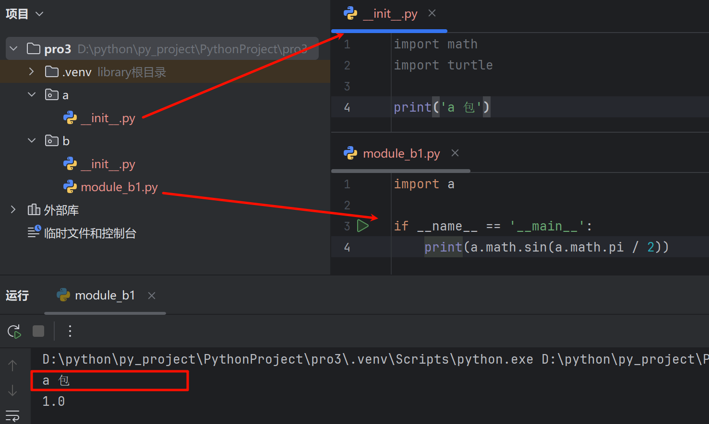

### 用 `*` 导入包

`import *` 这种语句理论上是希望文件系统找出包中所有的子模块，然后导入它们。这可能会花很多时间。python 解决方案是提供一个明确的`包索引`。

这个索引由 `__init__.py 定义 __all__ 变量`，该变量是一个`列表`，其中可以定义：`__all__ = ['module_A1', 'module_A2']`

这意味着，`from b import *` 会从对应的包中导入以上两个子模块。但仍然不建议这样导入。

## PIP 模块管理工具

pip 是一个现代的，通用的Python包管理工具。提供了对 Python 包的查找、下载、安装、卸载的功能。

### 第一种方式：命令行下远程安装

1. pip更换数据源\(由于访问国外网站慢，建议更换\)：

家目录中，创建 pip 目录，然后增加文件： pip\.ini 内容拷贝下 面的即可\(不要加其他字符\)：

```TOML
[global]
index-url = https://mirrors.aliyun.com/pypi/simple/

[install]
trusted-host=mirrors.aliyun.com
```

Linux的家目录： \~ 增加目录和文件：` ~/.pip/pip.conf` 

Windows的家目录是： `c:/user/用户名` 增加目录和文件： `c:/user/用户名/pip/pip.ini `

**临时使用镜像源，不改全局配置**： `pip install -i ``http://mirrors.aliyun.com/pypi/simple`` pandas`

2. 其它数据源

> 阿里云 http://mirrors\.aliyun\.com/pypi/simple/
> 
> 豆瓣：http://pypi\.douban\.com/simple/
> 
> 中国科学技术大学 : https://pypi\.mirrors\.ustc\.edu\.cn/simple
> 
> 清华：https://pypi\.tuna\.tsinghua\.edu\.cn/simple
> 
> 华中理工大学 : http://pypi\.hustunique\.com/simple
> 
> 山东理工大学 : http://pypi\.sdutlinux\.org/simple
> 
> V2EX：http://pypi\.v2ex\.com/simple
> 
> 

### 第二种方式：pycharm 中直接安装到项目

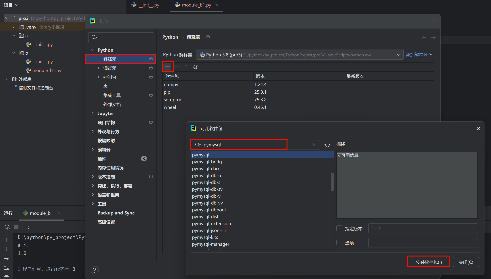

# Python 项目管理

## Anaconda 和 Miniconda 介绍

Anaconda指的是一个非常强大的Python发行版本，其包含了 conda、Python等180多个科学包及其依赖项。因为包含了大量的 科学包，Anaconda 的下载文件比较大，如果只需要某些包，或者需要节省带宽或存储空间，也可以使用Miniconda这个较小的发行版（仅包含conda和 Python）。

conda是一个开源的包、环境管理器，可以用于在同一个机器上安装不同版本的软件包及其依赖，并能够在不同的环境之间切换。

Miniconda下载地址

https://repo\.anaconda\.com/miniconda/ 

https://mirrors\.tuna\.tsinghua\.edu\.cn/anaconda/miniconda/

## conda 虚拟环境

Python 应用经常需要使用一些第三方包或者模块，有时需要依赖特定的包或者库的版本，所以不能有一个能适应所有 Python 应用的软件环境。解决这一问题的方法就是虚拟环境。

虚拟环境是一个包含了特定 Python 解析器以及一些软件包，不同的应用程序可以使用不同的虚拟环境，从而解决了依赖冲突问题， 而且虚拟环境中只需要安装应用相关的包或者模块，可以给部署提供便利。

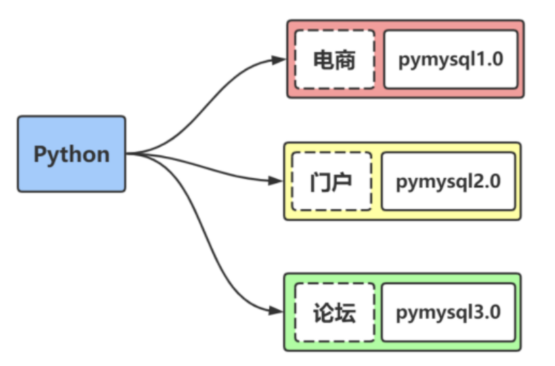

### Anaconda 虚拟环境命令

```PowerShell
# 1、显示已存在的虚拟环境，有 * 号就表示当前在这个环境
conda info --envs

# 2、创建虚拟环境
conda create -n 虚拟环境名称 python=版本号

# 3、删除虚拟环境
conda remove -n 虚拟环境名称 --all

# 4、激活\进入虚拟环境
conda activate 虚拟环境名称

# 5、退出虚拟环境
conda deactivate 虚拟环境名称

# 6、列出当前虚拟环境中的所有包及其版本
conda list
```

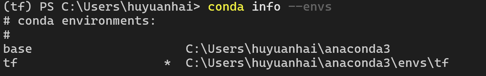

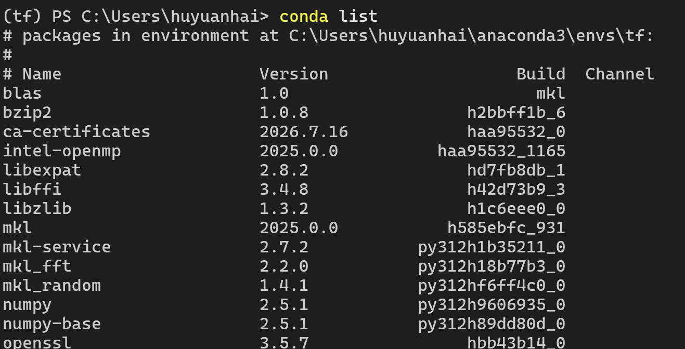

创建虚拟环境后，默认会在Anaconda安装目录的`envs`下， 创建虚拟环境相关文件。

## conda 软件模块的管理

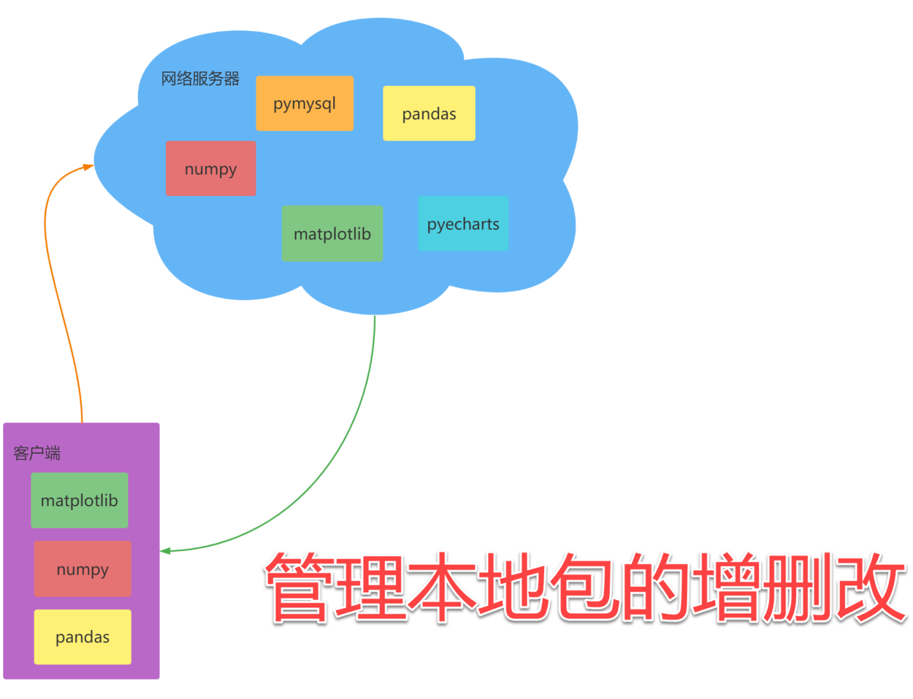

conda是一个软件的管理器，可用来下载、删除Python的软件包\(与 pip 有些类似\) 。

```PowerShell
# 1、安装模块、软件
conda install 软件/模块名

# 2、卸载模块、软件
conda remove 软件/模块

# 3、查看虚拟环境中的包
conda list
```

**pip 管理**

```PowerShell
# 1、安装模块、软件
pip install 软件/模块名

# 2、卸载模块、软件
pip uninstall 软件/模块

# 3、查看虚拟环境中的包
pip list
```

**conda 对比 pip**

conda在安装包时会同时处理所有依赖关系，包括 

- Python解释器版本 

- C/C\+\+库 

- CUDA等硬件相关的依赖 

- 其他编程语言的依赖 

conda使用严格的依赖解析器，可以预先检查所有依赖冲突 ；

pip 只管理Python包，不管理系统级别的依赖。

## 数据源与路径设置

**1、重点**

- 设置虚拟环境目录（转移到其它位置，避免磁盘过载）

- 设置下载软件的数据源（国外的比较慢，可以设置成国内的，下载快）

- 设置缓存目录（不是每次都需要下载，会缓存一份，提高效率）

**2、配置文件**

Linux 用户可以通过修改用户目录下的 `.condarc` 文件。

Windows 用户无法直接创建名为 `.condarc` 的文件，可先执行 `conda config` 生成该文件之后再修改。

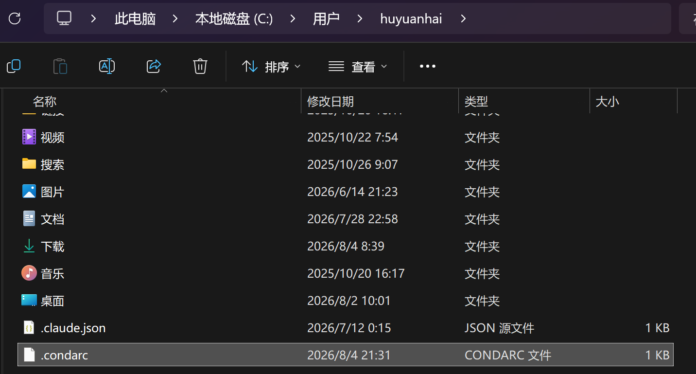

**3、conda信息**

`conda info` 可以获取 conda 的系统信息。

```PowerShell
(tf) PS C:\Users\huyuanhai> conda info

     active environment : tf
    active env location : C:\Users\huyuanhai\anaconda3\envs\tf
            shell level : 2
       user config file : C:\Users\huyuanhai\.condarc
 **populated config files** : C:\Users\huyuanhai\.condarc
          conda version : 4.8.3
    conda-build version : 3.18.11
         python version : 3.8.3.final.0
       virtual packages :
       base environment : C:\Users\huyuanhai\anaconda3  (writable)
           **channel URLs** : https://repo.anaconda.com/pkgs/main/win-64
                          https://repo.anaconda.com/pkgs/main/noarch
                          https://repo.anaconda.com/pkgs/r/win-64
                          https://repo.anaconda.com/pkgs/r/noarch
                          https://repo.anaconda.com/pkgs/msys2/win-64
                          https://repo.anaconda.com/pkgs/msys2/noarch
          **package cache** : C:\Users\huyuanhai\anaconda3\pkgs
                          C:\Users\huyuanhai\.conda\pkgs
                          C:\Users\huyuanhai\AppData\Local\conda\conda\pkgs
       **envs directories** : C:\Users\huyuanhai\anaconda3\envs
                          C:\Users\huyuanhai\.conda\envs
                          C:\Users\huyuanhai\AppData\Local\conda\conda\envs
               platform : win-64
             user-agent : conda/4.8.3 requests/2.24.0 CPython/3.8.3 Windows/10 Windows/10.0.26100
          administrator : False
             netrc file : None
           offline mode : False
```

### conda 数据源

以清华大学开源软件镜像站为例：https://mirrors\.tuna\.tsinghua\.edu\.cn/help/anaconda/

- 直接修改配置文件

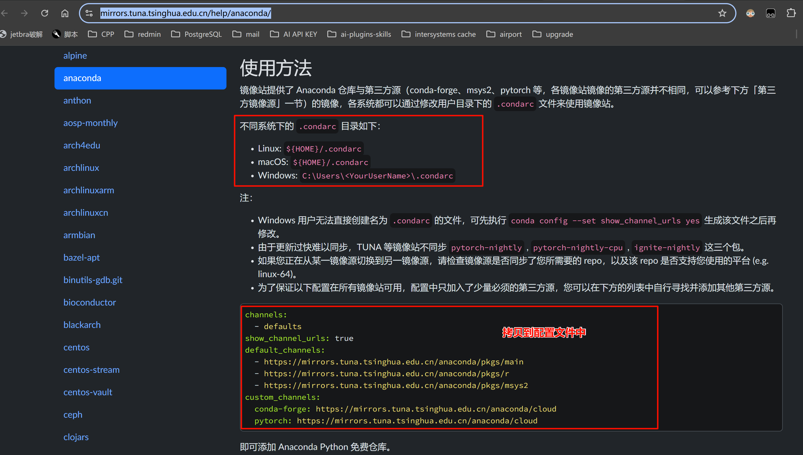

需要看 `conda info` 信息中，`populated config files` 有多个配置文件，需要改最近的一个。修改后，使用 `conda info` 查看如下：

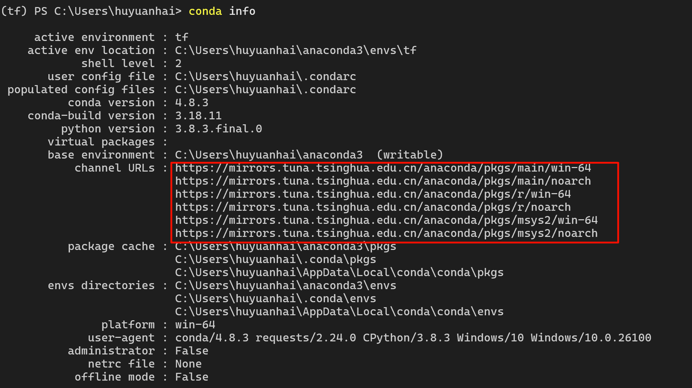

- 通过命令修改

```PowerShell
conda config --add channels https://mirrors.tuna.tsinghua.edu.cn/anaconda/pkgs/free/
conda config --add channels https://mirrors.tuna.tsinghua.edu.cn/anaconda/pkgs/main/
conda config --add channels https://mirrors.tuna.tsinghua.edu.cn/anaconda/cloud/conda-forge
conda config --add channels https://mirrors.tuna.tsinghua.edu.cn/anaconda/cloud/msys2/
```

- pip数据源修改

```PowerShell
pip config set global.index-url https://pypi.tuna.tsinghua.edu.cn/simple
```

### 设置虚拟环境目录

在上述配置文件中，继续增加这个配置，修改后，在 `conda info` 中可以查看，对应 `envs directories` 这个字段。

```PowerShell
envs_dirs:  
  - D:\miniconda3\envs
```

### 设置缓存软件目录

在上述配置文件中，继续增加这个配置，修改后，在 `conda info` 中可以查看，对应 `package cache` 这个字段。

```PowerShell
pkgs_dirs:
  - D:\miniconda\pkgs
```

## pycharm安装与使用

pycharm的下载 https://www\.jetbrains\.com/pycharm/download

pycharm项目虚拟环境

- 手动安装的python环境

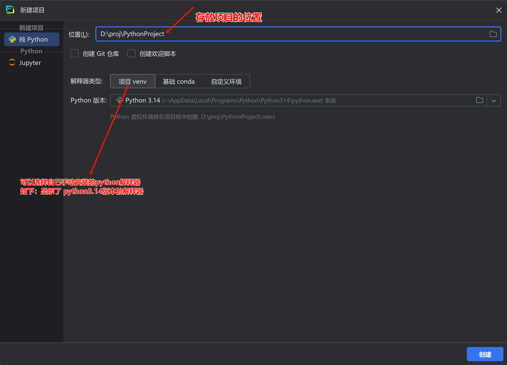

- Anaconda base 虚拟环境

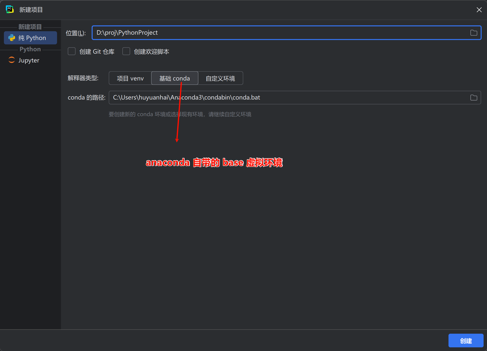

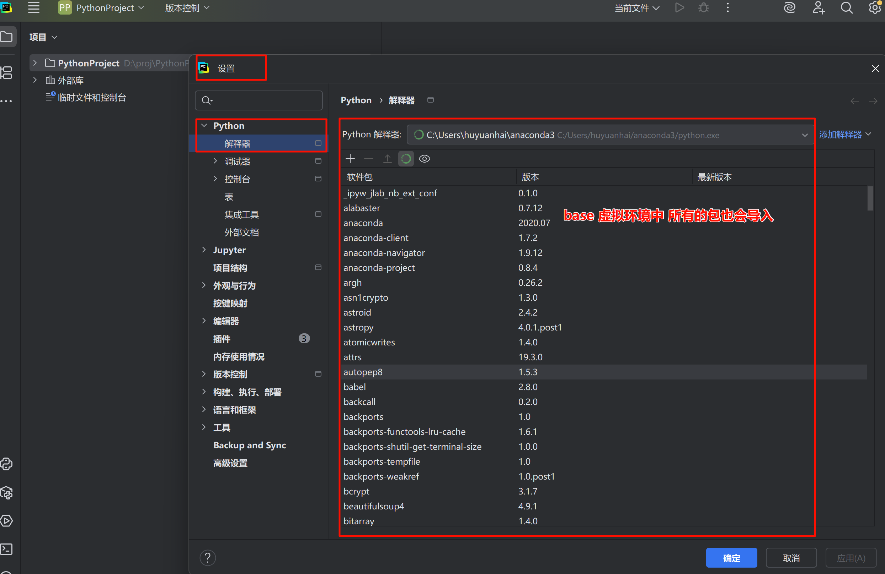

- 自定义选择python环境或虚拟环境


## VSCode配置python环境

Vscode 简洁，需要安装插件来配置开发环境。


## python项目管理文件

项目代码移植到其它主机或者平台，无法直接运行，需要有相同的解释器以及依赖包。如果在新的主机上逐个按版本安装，非常繁琐。

开发项目的时候`不能直接无脑的在环境中安装依赖包`，否则要打包代码给到其它地方会导致不知道具体需要依赖哪些以及哪些版本的第三方库。需要用这个项目管理文件处理这个问题。

### 早期管理工具（使用 conda 虚拟环境测试）

使用 `requirements.txt` 管理环境。

1. 使用 conda 创建虚拟环境测试

```PowerShell
conda create -n myenv python=3.12
```

2. 使用 Vscode 进入某个目录作为项目目录


3. 指定上述创建的 myenv 虚拟环境作为这个项目的环境


4. 此时在这个虚拟环境中安装上述的两个模块 `pymysql` 和 `flask`

```PowerShell
conda install pymysql

conda install flask
```


5. 此时可以使用这两个模块


6. `pip freeze` 命令生成 `requirements.txt` 管理文件

`pip freeze` 命令以特定的格式（`包名==版本号`）列出当前激活的 Python 环境中所有已安装的第三方包。

```PowerShell
(myenv) D:\proj\python>pip freeze > requirements.txt
```

### 早期管理工具（使用 python 自带的虚拟环境测试）

1. 创建虚拟环境

```Python
python -m venv .venv
```


2. 安装 pymysql 和 flask 模块

```PowerShell
(.venv) D:\proj\python2> pip install pymysql flask # 相关依赖也会安装

(.venv) D:\proj\python2>pip list
Package            Version
------------------ -------
blinker            1.8.2  
click              8.1.8  
colorama           0.4.6  
flask              3.0.3  
importlib-metadata 8.5.0  
itsdangerous       2.2.0  
jinja2             3.1.6  
MarkupSafe         2.1.5  
pip                19.2.3 
pymysql            1.1.2  
setuptools         41.2.0 
werkzeug           3.0.6  
zipp               3.20.2 
```

3. `pip freeze` 命令

```PowerShell
(.venv) D:\proj\python2>pip freeze
blinker==1.8.2
click==8.1.8
colorama==0.4.6
flask==3.0.3
importlib-metadata==8.5.0
itsdangerous==2.2.0
jinja2==3.1.6
MarkupSafe==2.1.5
pymysql==1.1.2
werkzeug==3.0.6
zipp==3.20.2
```


4. 移植项目到其它地方

把源码和刚才的 `requiremental.txt` 文件放到新的目录中


5. 重新搭建虚拟环境


6. 使用 `requiremental.txt` 安装依赖包

```PowerShell
pip install -r requiremental.txt
```


### 进阶管理

早期管理的方式会把核心模块以及它本身依赖的模块全部展示出来，即使后面卸载了核心模块，其依赖的模块还会保留，导致“幽灵依赖”。

进阶管理就是解决了这个问题。它**显式声明需要哪些核心模块**，可以集中管理其它工具。

1. 创建 `pyproject.tmol` 文件

大概格式如下：

```TOML
[project] 
name = "project name" 
version = "0.1.0" 
dependencies=[
    "flask",
    "pymysql"
]
```

2. 测试使用


然后，使用 `pip install -e .` 下载依赖的模块，如果需要增加模块，直接编辑这个文件然后使用这个命令即可触发模块下载。如果这个命令失败了就升级 `pip`。

## UV 的使用

`uv` 是一个Python 包和虚拟环境 管理工具。它的目标是替代 `pip`和 `virtualenv`，主打 **速度** 和 **可重现性。**总之，它既可以用来下载包又可以管理项目，避免了上述还需要手动编辑项目环境管理文件的情况。

**原使用方法:**

不灵活，不够自动化，需要手动管理依赖文件。

```PowerShell
python -m venv .venv # 创建原生虚拟环境，或者使用 conda
create pyproject.toml # 创建一个 pyproject.toml 项目管理文件
edit pyproject.toml # 将核心依赖写入这个文件
pip install -e . # 安装新依赖，每次写入新的依赖到文件中，都需要重新执行这个命令
```

**uv的使用方式：**

```PowerShell
uv venv -p 3.9 .venv # 创建虚拟环境
uv init # 初始化，自动生成相关文件，包括项目管理文件
uv add pk_name # 添加包，自动处理项目管理文件
uv remove pk_name # 删除包，包的依赖包也会自动卸载
uv sync 
```

### uv使用（结合使用环境使用，按步骤）

- 下载 uv 工具，需要单独下载，官网：https://docs\.astral\.sh/uv/ 中有各个平台的下载方式，比如 windows：

```PowerShell
powershell -ExecutionPolicy ByPass -c "irm https://astral.sh/uv/install.ps1 | iex"
```

- 初始化工作区

```Python
# 1、进入一个工程目录，然后打开终端，输入：
uv init . # 也可以直接指定目录，. 表示当前目录
```

```PowerShell
PYTHON2/                          # 项目根目录（即 D:\proj\python2）
├── src/                          # 源码目录（src-layout 布局）
│   └── python2/                  # 包目录（包名即为 python2）
│       └── __init__.py           # 包初始化文件，使 python2 成为可导入的包
├── .python-version               # 锁定项目使用的 Python 版本（由 uv 自动生成）
├── pyproject.toml                # 项目核心配置文件（声明依赖、元数据、构建系统等）
└── README.md                     # 项目说明文档（通常用于描述项目用途）
```


- 环境同步

上述只是初始化了工作区，给出了相关的管理文件和项目结构，仍然是没有虚拟环境的。使用 `uv sync`

该命令：根据 `pyproject.toml` 和 `uv.lock` 的描述，把项目的虚拟环境（`.venv` 目录）“调整”到完全一致的状态。

执行后会生成虚拟环境 `.venv` 目录。这里只是下载了对应版本的 python 解释器，还没有第三方依赖。


- 编写依赖 `requests`模块的测试代码文件


- 使用 `uv add pk_name`


- 删除包 `uv remove pk_name`


### 命令参考列表

- 基本命令

```PowerShell
# 1、查看 uv 版本
(python2) PS D:\proj\python2> uv --version
uv 0.12.2 (46ead6098 2026-08-05 x86_64-pc-windows-msvc)

# 2、查看 uv 帮助信息
uv --help

(python2) PS D:\proj\python2> uv help
An extremely fast Python package manager.

Usage: uv [OPTIONS] <COMMAND>

Commands:
  auth                       Manage authentication
  run                        Run a command or script
  init                       Create a new project
  add                        Add dependencies to the project
  remove                     Remove dependencies from the project
  version                    Read or update the project's version
  sync                       Update the project's environment
  lock                       Update the project's lockfile
  export                     Export the project's lockfile to an alternate format
  tree                       Display the project's dependency tree
  format                     Format Python code in the project
  check                      Run checks on the project
  audit                      Audit the project's dependencies
  tool                       Run and install commands provided by Python packages
  python                     Manage Python versions and installations
  pip                        Manage Python packages with a pip-compatible interface
  venv                       Create a virtual environment
  build                      Build Python packages into source distributions and wheels
  publish                    Upload distributions to an index
  workspace                  Inspect uv workspaces
  cache                      Manage uv's cache
  self                       Manage the uv executable
  generate-shell-completion  Generate shell completion
  help                       Display documentation for a command

Cache options:
  -n, --no-cache               Avoid reading from or writing to the cache, instead using a temporary directory for the duration of the operation [env:
                               UV_NO_CACHE=]
      --cache-dir <CACHE_DIR>  Path to the cache directory [env: UV_CACHE_DIR=]

Python options:
      --managed-python       Require use of uv-managed Python versions [env: UV_MANAGED_PYTHON=]
      --no-managed-python    Disable use of uv-managed Python versions [env: UV_NO_MANAGED_PYTHON=]
      --no-python-downloads  Disable automatic downloads of Python. [env: "UV_PYTHON_DOWNLOADS=never"]

Global options:
  -q, --quiet...                                   Use quiet output
  -v, --verbose...                                 Use verbose output
      --color <COLOR_CHOICE>                       Control the use of color in output [possible values: auto, always, never]
      --system-certs                               Whether to load TLS certificates from the platform's native certificate store [env: UV_SYSTEM_CERTS=]
      --offline                                    Disable network access [env: UV_OFFLINE=]
      --allow-insecure-host <ALLOW_INSECURE_HOST>  Allow insecure connections to a host [env: UV_INSECURE_HOST=]
      --no-progress                                Hide all progress outputs [env: UV_NO_PROGRESS=]
      --directory <DIRECTORY>                      Change to the given directory prior to running the command [env: UV_WORKING_DIR=]
      --project <PROJECT>                          Discover a project in the given directory [env: UV_PROJECT=]
      --config-file <CONFIG_FILE>                  The path to a `uv.toml` file to use for configuration [env: UV_CONFIG_FILE=]
      --no-config                                  Avoid discovering configuration files (`pyproject.toml`, `uv.toml`) [env: UV_NO_CONFIG=]
  -h, --help                                       Display the concise help for this command
  -V, --version                                    Display the uv version
```

- Python 环境管理

```Python
# 1、查看已安装的 python 版本
(python2) PS D:\proj\python2> uv python list --only-installed  
cpython-3.14.0-windows-x86_64-none     C:\Users\huyuanhai\AppData\Local\Programs\Python\Python314\python.exe
cpython-3.13.14-windows-x86_64-none    C:\Users\huyuanhai\AppData\Roaming\uv\python\cpython-3.13-windows-x86_64-none\python.exe
cpython-3.8.3-windows-x86_64-none      C:\Users\huyuanhai\anaconda3\python.exe

# 2、设置默认 python 版本
uv python pin 3.10 # 将当前项目的 Python 版本“固定”为 3.10；修改 .python-version
```

### 依赖管理

- 添加依赖

```Python
# 依赖会自动添加到pyproject.toml 文件中，并更新.venv环境。
uv add requests
uv add "flask>=2.0,<3.0"
```

- 移除依赖

```Python
# 移除依赖，相关子依赖也会被移除；从 pyproject.toml 文件中删除，更新.venv环境
uv remove requests
```

- 更新依赖

```Python
# 仅针对 requests 这一个包，将其更新到符合项目约束的最新版本，
# 并同步更新锁文件（uv.lock），而项目声明文件（pyproject.toml）中的版本约束保持不变。
uv lock --upgrade-package requests
uv sync

# 直接升级所有依赖
uv lock --upgrage
uv sync
```

- 安装项目依赖

```Python
# 如果
uv pip install -e .
```

### 虚拟环境管理

```Python
# 创建虚拟环境，生成 .venv
uv venv

# 指定python版本和虚拟环境名称
uv venv -p python3.13 my_env
```


