# 04 函数式编程和核心特性

# 函数式编程核心（高阶函数、闭包等）

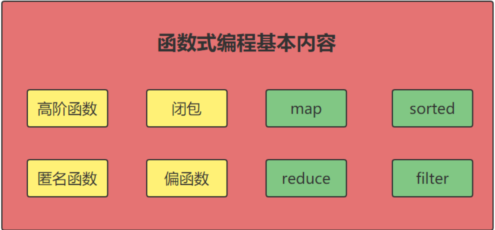

## 函数式编程

函数式编程（functional programming）是一个很古老的概念，距今快 60 年了。

最古老的函数式编程语言 LISP，新出现的函数式编程语言：比如 Erlang、Scala 等。

Python、Java、JavaScript、C\+\+ 等都增加了函数式编程的一些特性。

## 高阶函数和内存分析

> 1. 函数式编程最鲜明的特点就是：函数是一等公民。指的是函数与其它数据类型一样处于平等地位，可以赋值给其他变量，也可以作为参数传给另一个函数，或者作为别的函数的返回值。
> 
> 2. 一个函数可以接收另一个函数作为参数，这种函数就称之为高阶函数。
> 
> 3. Python内建的高阶函数有 `map`、`reduce`、`filter`、`sorted`。
> 
> 

```Python
def test1():
    print('test1...')

def test2(func):
    print('test2...')
    func()

if __name__ == '__main__':
    print(test1) # <function test1 at 0x0000021AA442B530>
    print(type(test1)) # <class 'function'>

    a = test1
    a() # test1...
    test2(a) # test2...    test1...
```

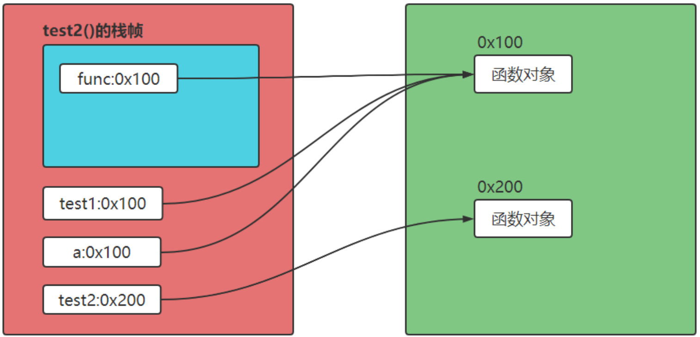

## lambda表达式和匿名函数

`lambda `表达式可以用来声明匿名函数。 lambda 函数是一种简单的、在同一行中定义函数的方法。 lambda 函数实际生成了一个函数对象。

lambda 表达式只允许包含一个表达式，不能包含复杂语句，该表达式的计算结果就是函数的返回值。

lambda表达式的基本语法如下：

`lambda  arg1,arg2,arg3... : <表达式>`

```Python
f = lambda a, b, c : a + b + c
print(f) # <function <lambda> at 0x0000029540FAB530>
print(f(2,3,4)) # 9

g = [lambda a : a * 2, lambda b : b * 3, lambda c : c * 4]
print(g[0](6), g[1](7), g[2](8)) # 12 21 32
```

## 偏函数

Python 的 `functools`模块提供了很多有用的功能，其中一个就是偏函数（Partial function）。

偏函数作用：就是把一个函数某些参数固定住（也就是设置默认值），返回一个新函数，调用这个新的函数会更简单。

举例如下：

int\(\) 函数可以把字符串转为整数，当仅传入字符串时，int\(\) 函数默认按十进制转换，代码：`print(int('123'))`

但 int\(\) 函数还提供额外的 base 参数，默认值为 10。如果传入 base 参数，就可以做 N 进制的转换。

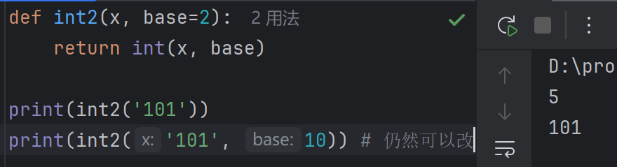

`functools.partial` 就是帮助我们创建一个偏函数的，不需要我们自己定义 int2\(\) ，可以直接使用下面的代码创建一个新的函数 `int2`

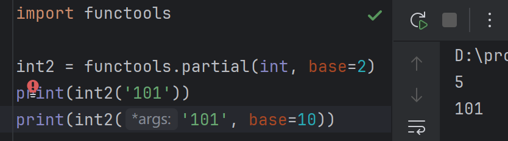

## 闭包

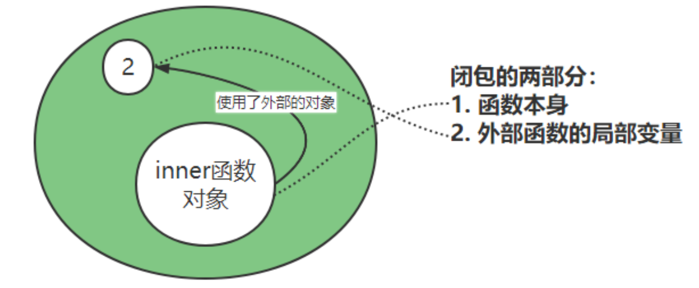

> 局部变量：如果名称绑定在一个代码块中，则为该代码块的局部变量，除非声明为 nonlocal 或 global 
> 
> 全局变量：如果模块绑定在模块层级，则为全局变量
> 
> 自由变量：如果变量在一个代码块中被使用但不是在其中定义，则为自由变量
> 
> 

### 闭包概念

函数的作用域是独立的、封闭的，外部的执行环境是访问不了的，但是闭包具有这个能力和权限。

闭包是一个函数，只不过这个函数有能力访问到另一个函数的作用域。函数和自由变量的综合就是一个闭包。

可以理解为闭包的作用是为了能使用函数作用域中的变量。

```Python
*'''*
*闭包特点：*
*    1、存在内外层函数嵌套的情况*
*    2、内层函数引用了外层函数的变量或者参数（自由变量）*
*    3、外层函数把内层的这个函数本身当成返回值返回*
*'''*
def outer():
    print('outer')
    v = 1
    def inner():
        print('inner')
        # 闭包是由于函数内部使用了函数外部的变量，这个函数对象不销毁，
        # 则外部函数的局部变量不会被销毁
        nonlocal v
        print(f'v:{v}')

    return inner

f = outer()
f()
```

### 闭包内存分析

1. 执行完 `inn = outer()` 的内存图。 `outer()` 栈帧执行完后实际已经消失了，画上去，是为了展现关系。

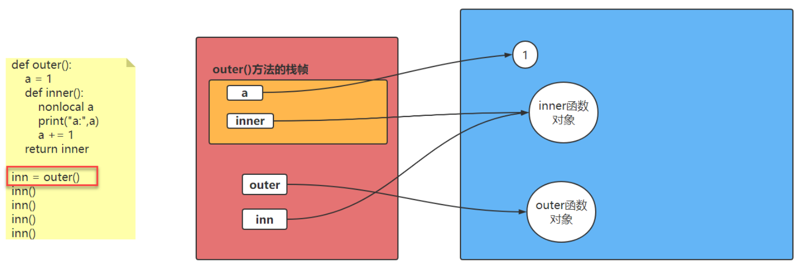

2. 执行完 `inn = outer()` 的内存图。由于 `inner()` 内部函数的调用， `outer()`栈帧消失后，局部变量 `a` 指向的对象 1 仍然存在。从而形成了"闭包"。

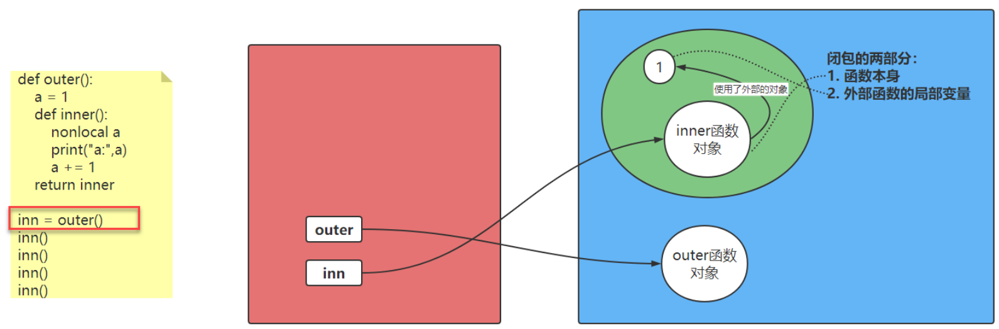

3. 第一次调用 `inn()` ，从而调用内部函数，仍然可以拿到以前局部变量指向的对象 `1`

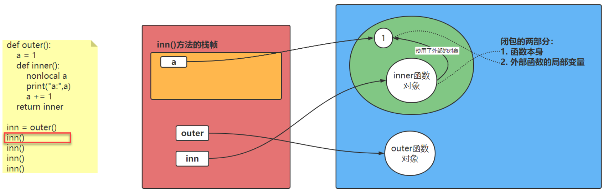

4. 第二次调用 `inn()` ，仍然可以继续拿到以前局部变量指向的对象 `1` ，并将值变为 `2` 

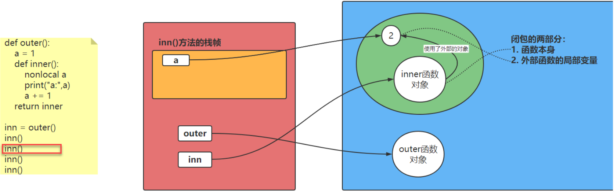

### 闭包的作用和缺点

闭包在爬虫以及web应用中都有很广泛的应用，闭包也是装饰器的基础。

1. 闭包作用

作用1：隐藏变量，避免全局污染

作用2：可以读取函数内部的变量

2. 闭包使用不当会变成缺点

缺点1：导致变量不会被垃圾回收机制回收，造成内存消耗

缺点2：不恰当的使用闭包可能会造成内存泄漏

### **闭包和自由变量\_全局变量污染问题的解决**

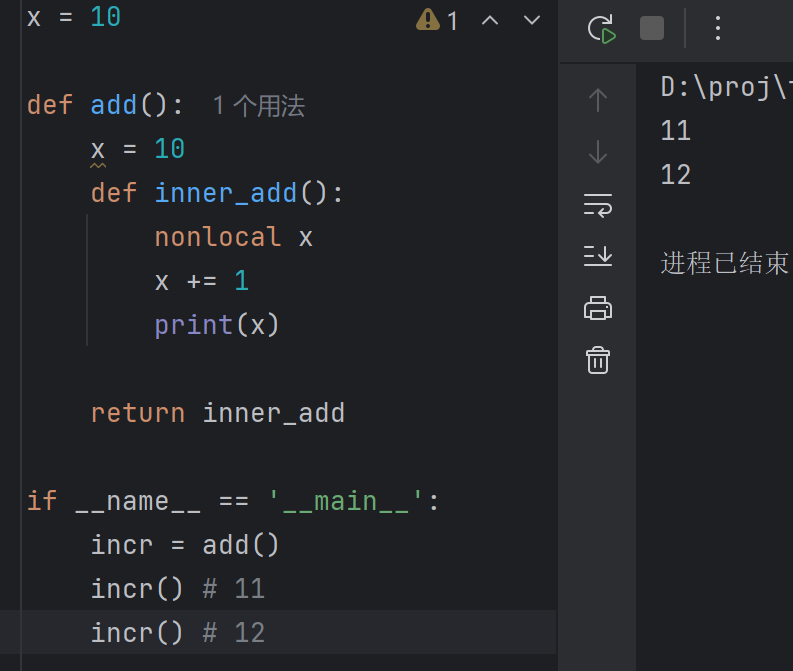

### 用闭包实现不修改源码添加功能——装饰器模式基础

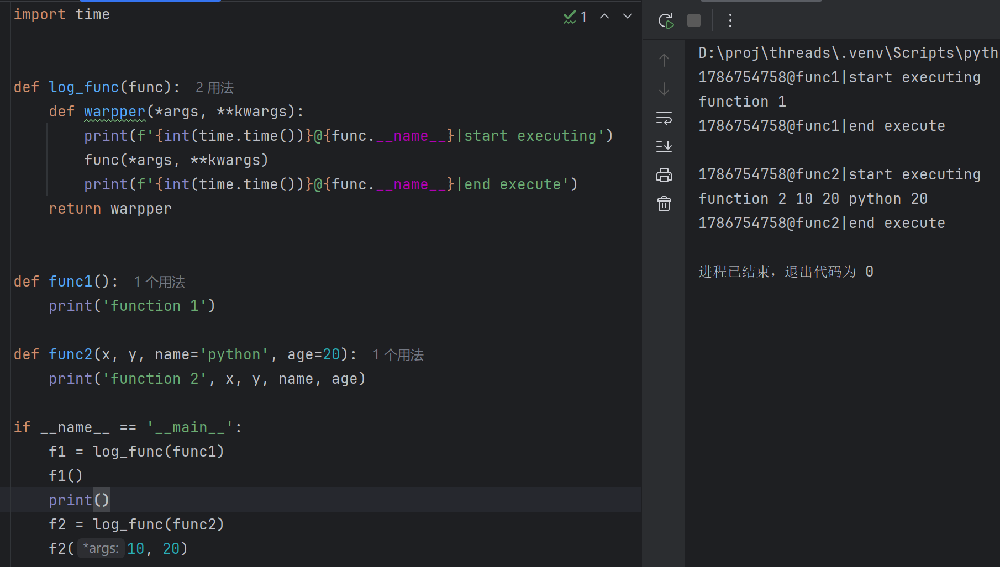

## map函数

`map`函数接收两个参数：一个是函数，一个是序列（并且可以传入多个序列）。

`map`将传入的函数依次作用到序列的每个元素，并把结果作为新的序列返回。这个函数的返回值类型是：`<class 'map'>`

### map函数实践

比如有一个函数 `f(x) = x ** 2`，要把这个函数作用在一个序列 list \[1, 2, 3, 4, 5, 6, 7, 8, 9\] 上，就可以用 map 实现如下：

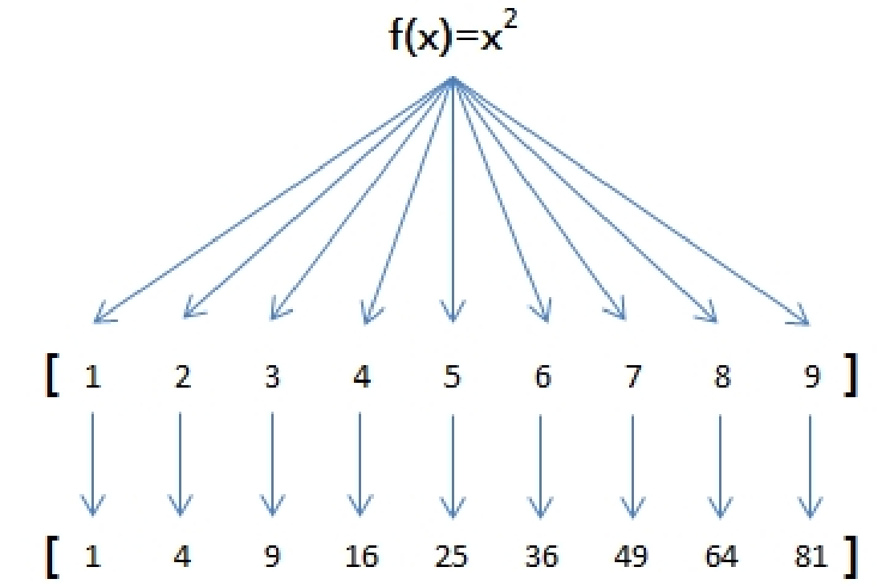

当然，不需要 map 函数也可以计算出结果，使用循环也可以解决，如下：

```Python
lst = [1, 2, 3, 4]
res = []

def func(x):
    return x ** 2

for i in lst:
    res.append(func(i))

print(res) # [1, 4, 9, 16]
```

使用 map 高阶函数的使用案例如下

```Python
def func(x):
    return x ** 2

lst = map(func, range(1, 10))
print(lst) # <map object at 0x000001CFC2FD2DC0>
print(type(lst)) # <class 'map'>
print(list(lst)) # 转为 list 类型
```

使用 lambda 处理

```Python
lst = map(lambda x:x**3, range(1, 10))
```

传入多个列表

```Python
def func(x, y):
    return x + y

'''
    如果多个序列，那么处理的函数的参数个数和序列个数一致
    当前，将两个序列对应位置的元素相加
    木桶效应：如果两个序列的元素个数不一致，那么按照元素最少的序列处理，而不是报错
'''
lst = map(func, range(1, 4), range(4, 10))
# lst = map(lambda x, y: x + y, range(1, 4), range(4, 19))
print(lst) # <map object at 0x000001CFC2FD2DC0>
print(type(lst)) # <class 'map'>
print(list(lst)) # [5, 7, 9]
```

### map函数返回值

关于 `map()` 的返回值，有几个非常重要的使用限制。这些限制源于它返回的是一个迭代器（Iterator），而不是一个容器（如列表或元组）。

1. 一次性消费，迭代器耗尽

迭代器像是一个“单程票”。当遍历完一次后，内部的指针会走到末尾，无法重置。如果你试图再次遍历，它会直接返回空，而不会报错，这常常导致隐蔽的逻辑错误。

如果需要复用结果，必须将 `map` 转换为列表（`list(map(...))`）或元组保存下来。

```Python

lst = map(lambda x, y: x + y, range(1, 4), range(4, 19))

print(list(lst)) # [5, 7, 9]
print(tuple(lst)) # ()
```

```Python

lst = map(lambda x, y: x + y, range(1, 4), range(4, 19))

print(tuple(lst)) # (5, 7, 9)
print(list(lst)) # []
```

2. 无法通过索引取值（不能使用 \[\] 和切片）

`map` 对象没有 `__getitem__` 方法，因此不能像操作列表那样直接获取第几个元素，也不能进行切片操作。

必须通过 `next(result)` 按顺序逐个获取，或者先转为列表再索引。

```Python

res = map(lambda x, y: x + y, range(1, 4), range(4, 19))

print(next(res)) # 5
print(next(res)) # 7
print(next(res)) # 9
print(next(res)) # 报错，超出了迭代器范围
```

3. 无法获取长度（不能用 len 函数）

```Python
res = map(lambda x, y: x + y, range(1, 4), range(4, 19))

# TypeError: object of type 'map' has no len()
print(len(res))
```

4. 惰性时差的计算陷阱

`map` 中的函数只有在迭代结果时才会真正执行。如果传入的函数有副作用（比如打印信息、修改外部变量），或者依赖外部实时数据，这个“延迟”可能会让人意外。

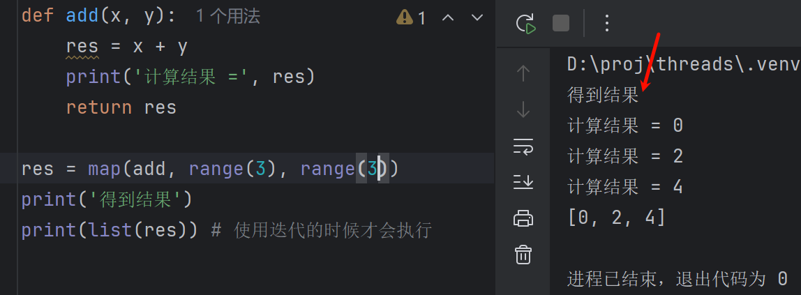

### 总结 map 函数

`map` 返回的迭代器是“工厂机器”，而不是“产品”；

得到的是“机器说明书”，而不是“零件清单”。

只有当启动它（遍历）时，产品（执行结果）才会诞生。

## reduce函数

`reduce`函数位于 `functools` 模块。

reduce把一个函数作用在一个序列上，这个函数必须接收两个参数，reduce把结果继续和序列的下一个元素做累计计算，其效果就是：

`reduce(f, [x1, x2, x3, x4]) = f(f(f(x1, x2), x3), x4)`

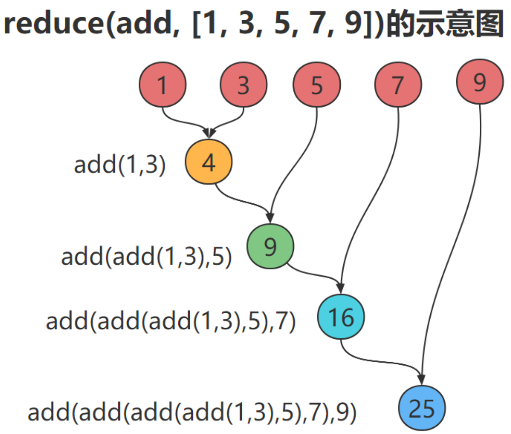

`reduce` 的核心功能是将一个可迭代对象中的所有元素，通过一个指定的二元函数（接收两个参数），逐步累积、归并，最终坍缩（折叠）成一个单一的结果值。

直接返回具体的单个值（整数、字符串、列表等），立即执行（急切求值，与 map 不同）

```Python
from functools import reduce

def add(x, y):
    return x + y

res = reduce(add, range(0, 101, 2)) # 求和 0 - 100 的偶数和
print(res)
```

## filter函数

`filter` 函数是内置函数，用于过滤序列。

`filter` 把传入的函数一次作用于每个元素，然后根据返回值是 True 还是 False，决定保留还是丢弃该元素。

与 map 函数一样，filter 函数返回值也不是返回结果，也是在迭代的时候执行的。

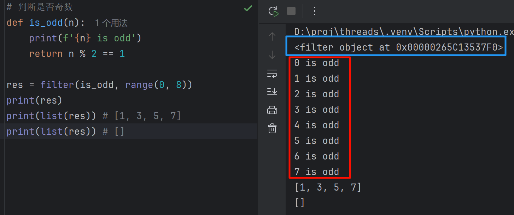

- 获取非空字符串

```Python
res = filter(lambda s: s and s.strip(), ['A', ' ', '  C', '', None])
print(list(res)) # ['A', '  C']
```

## sorted函数

排序算法，排序也是在程序中经常用到的算法。无论使用冒泡排序 还是快速排序，排序的核心是比较两个元素的大小。

> 1. 如果是数字，可以直接比较
> 
> 2. 如果是自定义对象呢？直接比较数学上的大小是没有意义的，因此，比较的过程必须通过函数抽象出来。通常规定，对于两个元素x和y，如果认为x \< y，则返回\-1，如果认为x == y，则返回0，如果认为x \> y，则返回1，这样，排序算法就不用关心具体的比较过程，而是根据比较结果直接排序。
> 
> 

```Python
sorted(序列, 
        key=函数名, # 指定自定义排序的函数，默认为 None
        reverse=False # 默认为 False，即升序
        )
```

1. 基础用法（默认升序）

```Python
nums = [3, 1, 4, 1, 5]
new_nums = sorted(nums)

print(new_nums)  # 输出: [1, 1, 3, 4, 5]
print(nums)      # 输出: [3, 1, 4, 1, 5] （原列表纹丝不动！）
```

2. 忽略字符串大小写排序

```Python
= sorted(["ABC", "abc", "D", "d"], key=str.lower)
print("忽略字符串大小写排序:",res) # ['ABC', 'abc', 'D', 'd']
```

3. 自定义类比较

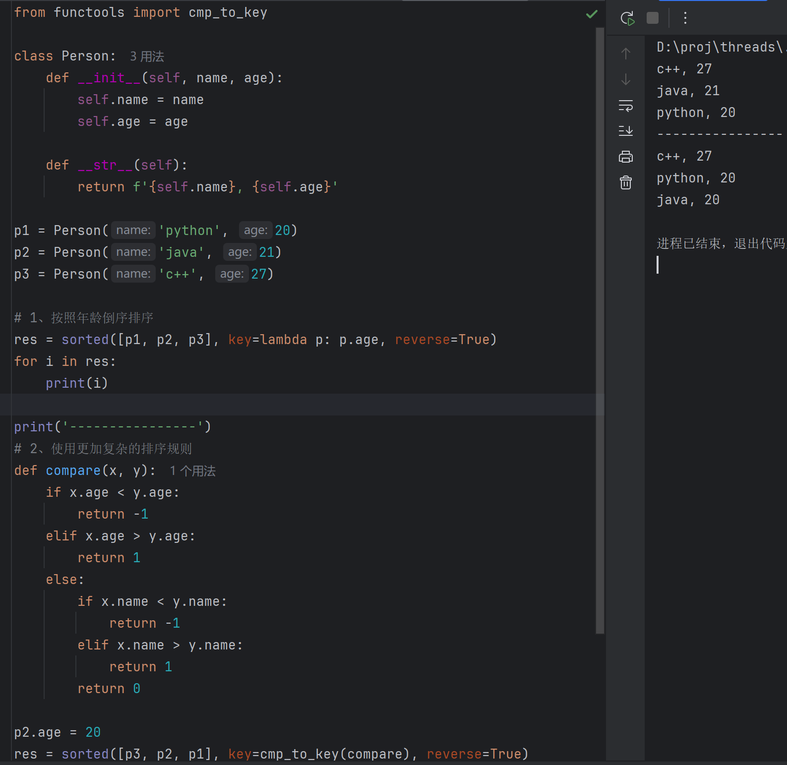

# 装饰器深入剖析

## 概念

装饰器本质上是一个Python函数（其实就是闭包），它可以让其他函数在不需要做任何代码变动的前提下增加额外功能，装饰器的返回值也是一个函数对象。 

装饰器用于有以下场景，比如：插入日志、性能测试、事务处理、 缓存、权限校验等场景。

## 日志问题

1. 直接使用闭包实现日志打印功能

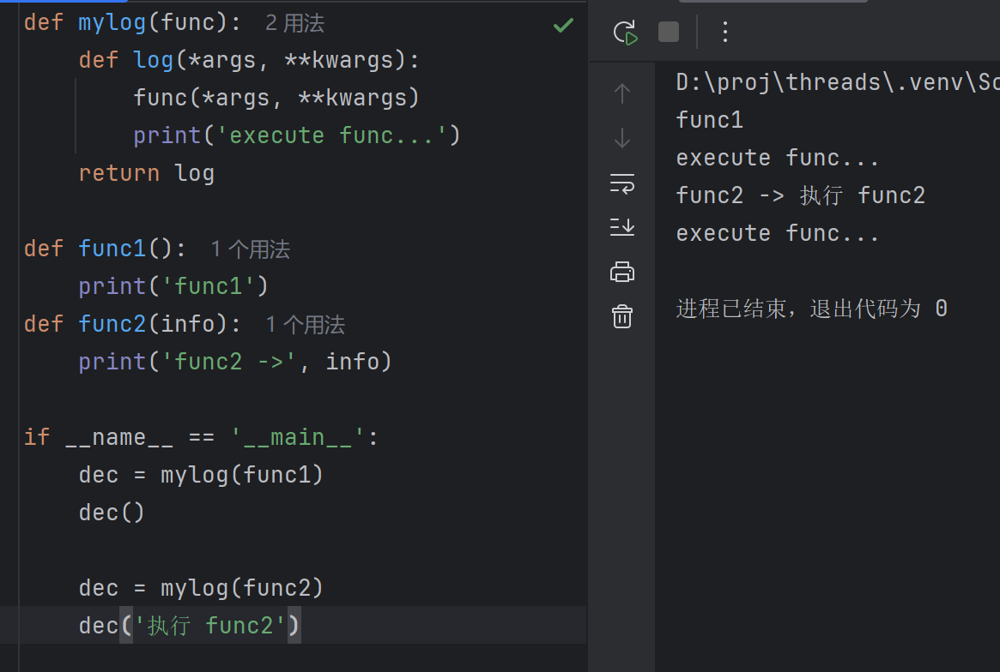

2. 使用装饰器

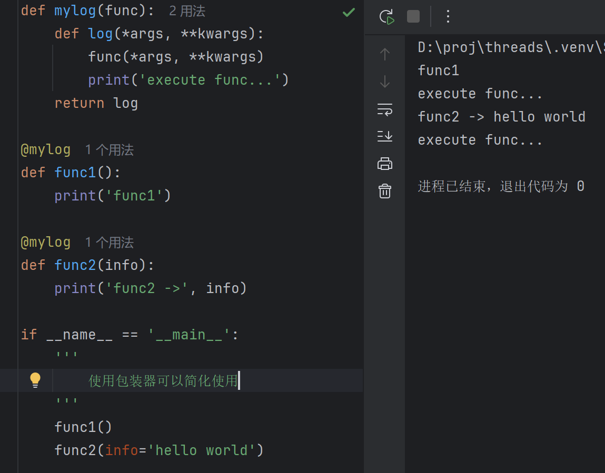

## 多个装饰器

有时候需要多个装饰器修饰一个函数。比如需要增加日志功能、增加执行效率测试功能。

装饰器函数的执行顺序是分为（被装饰函数）定义阶段和（被装饰函数）执行阶段，执行器函数在被装饰函数定义好后立即执行。

- 在函数定义阶段：执行顺序是从最靠近函数的装饰器开始，自内而外执行。

- 在函数执行阶段：执行顺序由外而内，一层层执行。

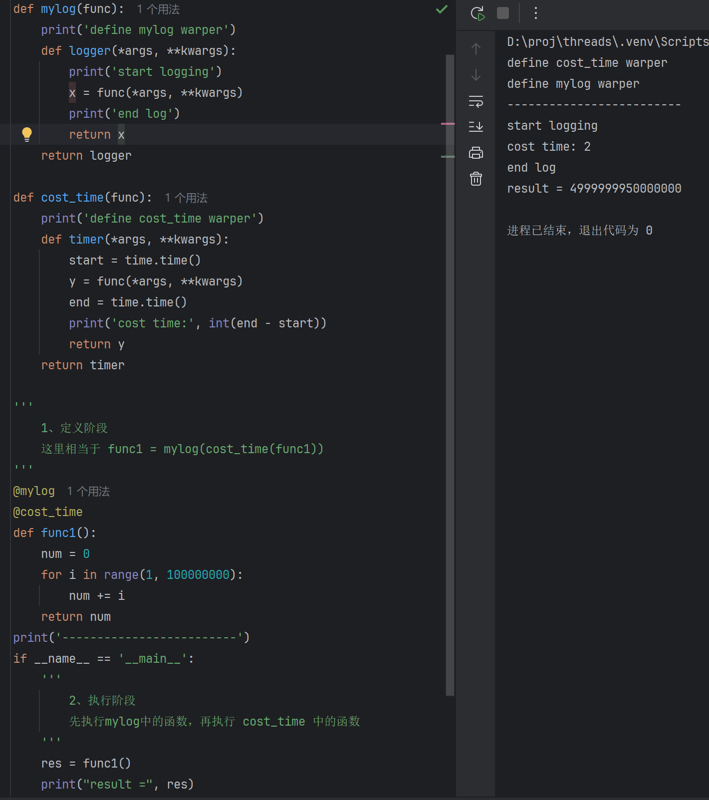

## 带参数的装饰器

多加一层函数

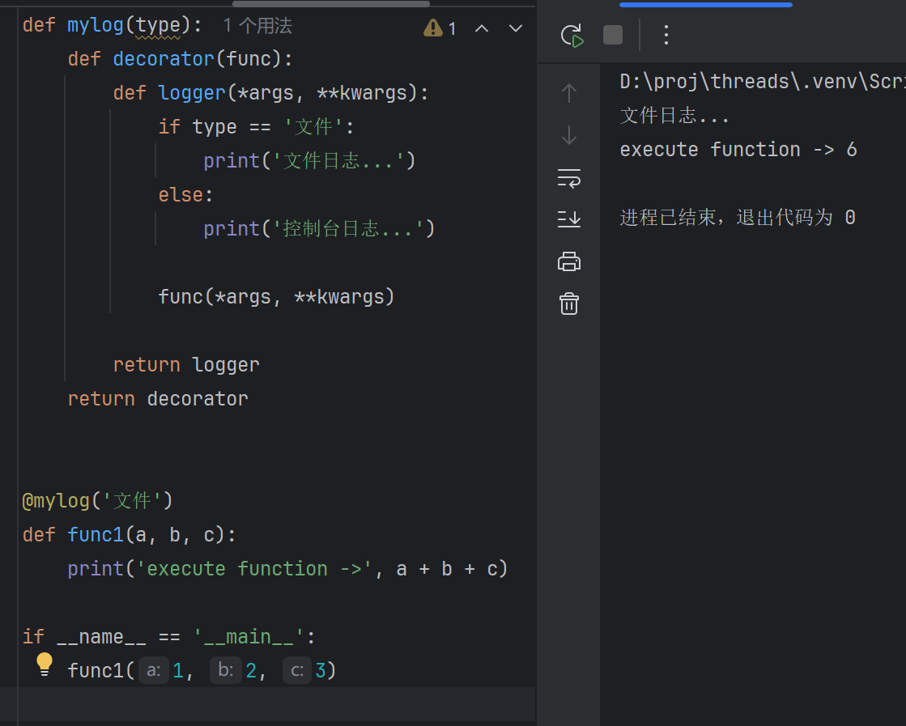

## wraps装饰器

一个函数不止有执行语句，还有 `__name__` \(函数名\)，`__doc__` \(说明文档\) 等属性。

functools\.wraps 可以将原函数对象的指定属性赋值给包装函数对象，默认有 module、name、doc 或者通过参数选择。

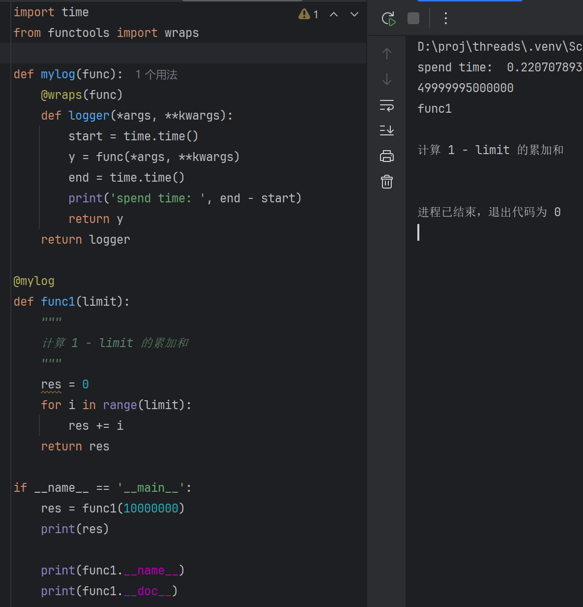

1. 装饰器的“偷梁换柱”本质

装饰器语法糖 `@mylog` 本质上执行了这一步：`func1 = mylog(func1)`。

这意味着，`func1` 变量不再指向原函数，而是指向了内部新生成的 logger 函数。

2. 不用 `@wraps` 会怎么样？

如果不加 `@wraps`，python 不会报错，但是会埋下两个坑：

- 身份信息被掉包。比如打印 `func1.__name__` 得到的不是 func1，而是内部函数名 `logger`。文档 `__doc__` 也会变成 `None`。这导致 `help()` 无法使用，代码变得难以维护。

- 调试排错更加困难。如果 `func1` 内部报错，Traceback 会指向 `logger` 函数内部，而不是业务函数 `func1`。

3. `@wraps` 做了什么？

`@wraps(func)` 就像一个属性复读机。他不改变装饰器的逻辑，只是强行把原函数 func 的 \_\_name、\_\_doc\_\_ 等元数据，原封不动的复制给新函数 logger。

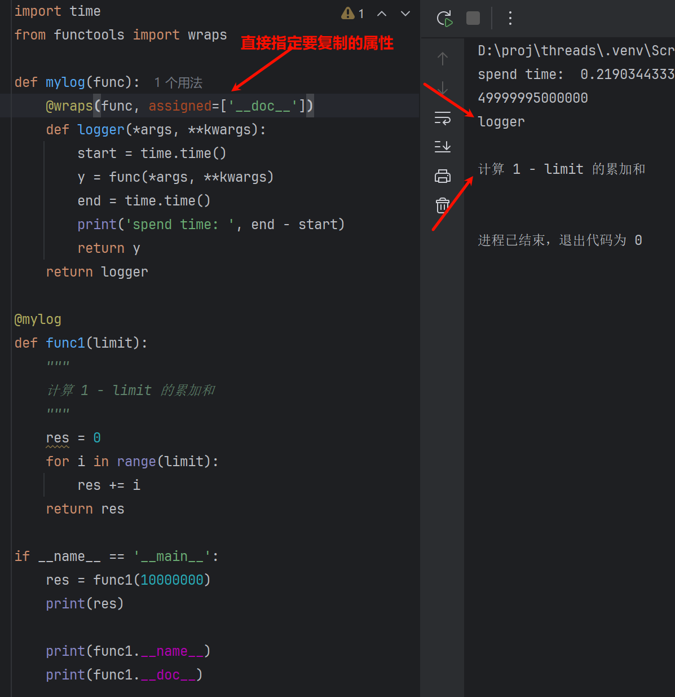

## 内置装饰器

在面向对象中，学过三种装饰器：`property`、`staticmethod`、`classmethod`。

### property装饰器

property装饰器用于类中的函数，使得我们可以像访问属性一样来获取一个函数的返回值。作用的函数不能有额外参数。

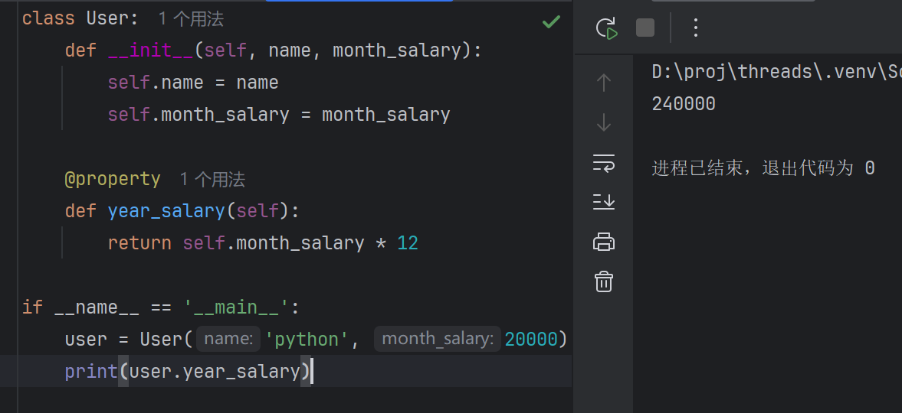

### staticmethod装饰器

`@staticmethod`装饰器同样是作用于类中的方法，这表示这个方法将会是一个静态方法，这意味着无需实例化就可以调用这个函数，同时也意味着没有 `self` 参数，也无法访问实例化后的对象。静态函数中无法访问实例属性。

```Python
class Person:

    @staticmethod
    def say_hello():
        print('hello')

if __name__ == '__main__':
    Person.say_hello()
```

### classmethod装饰器

`@classmethod`这个方法是一个类方法。该方法无需实例化，没有 self 参数。相对于 staticmethod 的区别在于它会接收一个指向类本身的 cls 参数。 

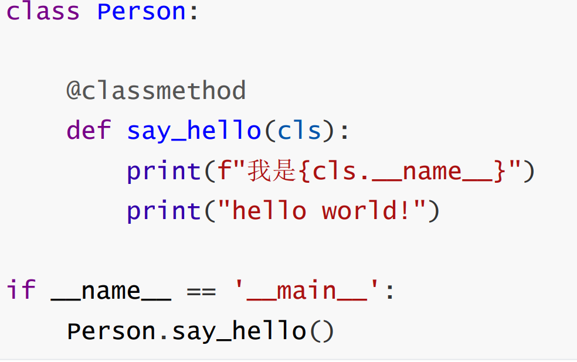

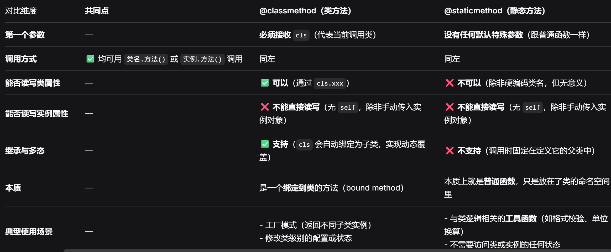

## 类装饰器

类能实现装饰器的功能， 是由于当我们调用一个对象时，实际上调用的是它的 `__call__` 方法。

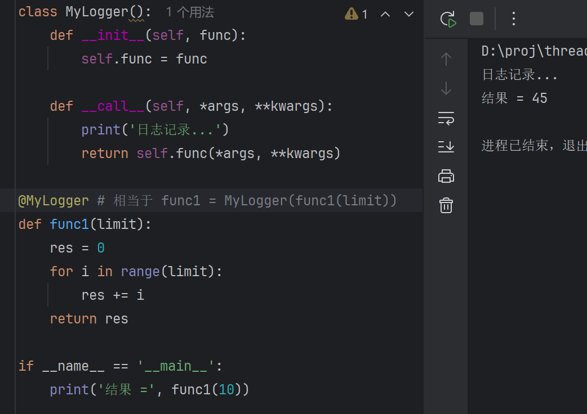

## 缓存装饰器和计时装饰器综合练习

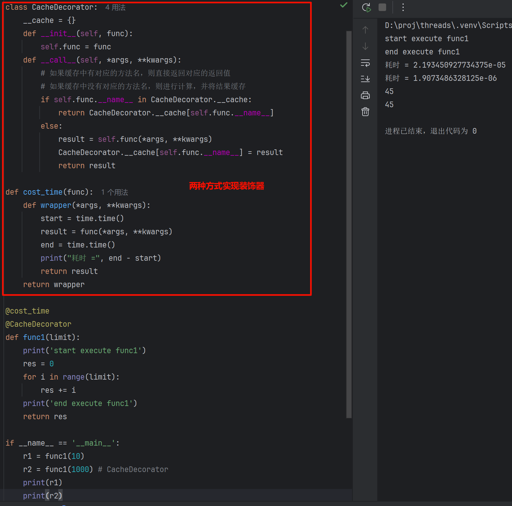

# 生成器\_迭代器\_动态性

## 生成器

### 生成器定义和意义

在 python 中，一边循环一边计算的机制，称为生成器（`generator`）。

列表所有数据都在内存中，如果有海量数据会非常耗内存，甚至不够用。如果：仅仅需要访问前面几个元素，那后面绝大多数元素占用的空间都浪费了。

如果列表元素按照某种算法推算出来，那么就可以在循环过程中不断推算出后续的元素，这样就不必创建完整的 list，从而节省大量空间。

总之：

- 时间换空间。想要获取庞大数据，又像少占空间，就用生成器。

- 延迟计算。需要的时候再计算出来。

### 创建生成器的方式（两种）

1. 生成器表达式创建生成器

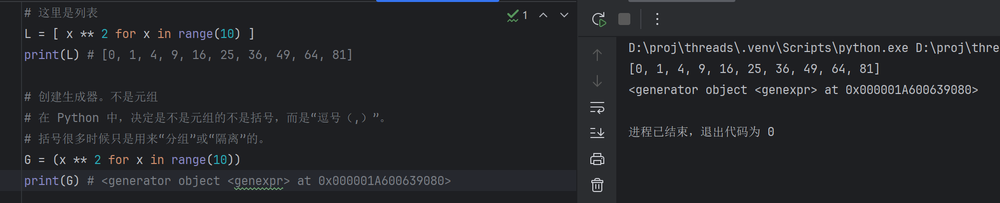

2. 生成器函数创建生成器

```Python
def test():
    print('start execute')

    x = 1
    while x <= 3:
        '''
        1. 函数中出现 yield 后，该函数就是生成器函数。
        调用时不会立即执行函数体，而是返回一个 generator 对象。

        2. yield 的作用：
        - 返回当前值
        - 暂停程序执行
        - 保存当前执行状态和局部变量

        下一次调用 next() 时，
        会从 yield 的下一条语句继续执行。
        如果是 y = yield x ，那么下一条语句就是赋值，而不是下一行语句
        '''
        yield (x + 200)

        print(x)
        x = x + 1

    print('end execute')

    '''
    3. 生成器执行到函数末尾，或者执行 return，
    都表示生成器结束，并触发 StopIteration。
    '''


if __name__ == '__main__':
    '''
    test() 只创建生成器对象，
    此时函数体还没有真正执行。
    '''
    func = test()

    print(type(func))

    '''
    4. next() 的作用：启动或唤醒生成器。

    第一次 next()：
    从函数开头开始执行，直到 yield 1，
    yield 返回 1，所以 print(next(func)) 打印 1。

    第二次 next()：
    从上一次 yield 后继续执行，
    然后执行到 yield 2，返回 2。

    第三次 next()：
    继续执行到 yield 3，返回 3。
    '''
    print(next(func))
    print(next(func))
    print(next(func))

    '''
    5. 如果这里再执行一次 next(func)，
    生成器会继续运行直到函数结束，
    然后抛出 StopIteration。
    '''
    # print(next(func))
    try:
        print(next(func))
    except StopIteration:
        print('生成器已经结束，没有更多数据')
```

```Python
def test():
    print('start execute')

    x = 1
    while x <= 3:
        '''
        yield (x + 200) 会把结果返回给外部，并暂停生成器。

        注意：
        tmp 此时还没有完成赋值。

        下一次调用 next() 恢复生成器时，
        next() 相当于 send(None)，
        所以 yield 表达式的结果是 None，
        最终相当于：
            tmp = None
        '''
        tmp = yield (x + 200)

        print('x =', x)
        print('tmp =', tmp)

        x = x + 1

    print('end execute')

if __name__ == '__main__':
    func = test()

    '''
    第一次 next()
    x = 1
    执行：
        yield (1 + 200)

    向外返回 201，然后暂停。
    此时 tmp 还没有赋值。
    '''
    print(next(func))

    '''
    第二次 next()
    从上一次 yield 的位置恢复。
    next() 相当于：
        func.send(None)
    因此：
        tmp = None

    然后 x 变成 2，
    再执行 yield 202。
    '''
    print(next(func))

    '''
    第三次 next()
    同理：
        tmp = None

    然后 x 变成 3，
    再执行 yield 203。
    '''
    print(next(func))

    '''
    如果继续调用 next()：
    tmp = None
    x 变成 4
    while 条件不成立
    生成器结束
    最终抛出 StopIteration。
    '''
    try:
        print(next(func))
    except StopIteration:
        print('生成器执行结束')
```

- send用法

```Python
# send() 的作用：
# 1. 唤醒生成器，让它从上一次 yield 暂停的位置继续执行
# 2. 向生成器内部发送一个值
# 3. 发送的值会作为 yield 表达式的结果，赋值给 yield 左边的变量
#
# next(g) 可以近似理解为 g.send(None)

def foo():
    print("start")
    i = 0
    while i < 2:
        '''
        第一次执行到这里时：yield i

        会把 i 返回给外部，然后暂停。
        注意：temp 此时还没有赋值。

        当下一次使用：g.send(100)
        恢复生成器时，相当于：
            temp = 100
        '''
        temp = yield i

        print(f"temp:{temp}")
        i = i + 1

    print("end")

if __name__ == '__main__':
    # 创建生成器对象，此时 foo() 内部代码还没有执行
    g = foo()
    '''
    第一次必须先启动生成器。
    next(g)：
        1. 开始执行 foo()
        2. print("start")
        3. i = 0
        4. 执行 yield 0
        5. 返回 0
        6. 生成器暂停
    
    此时暂停在：temp = yield 0
    但 temp 还没有赋值。
    '''
    print(next(g))
    print("*" * 20)

    '''
    send(100) 做两件事：
    1. 唤醒生成器
    2. 把 100 发送给上一次暂停的 yield
    
    所以：temp = yield 0
    恢复之后相当于：temp = 100
    接下来执行：
        print("temp:100")
        i = 1
    
    然后再次执行：temp = yield 1
    yield 1 返回 1，并再次暂停。
    '''
    print(g.send(100))

    '''
    next(g) 可以近似理解为：g.send(None)
    
    所以这一次恢复：temp = yield 1
    相当于：temp = None
    然后：
        print("temp:None")
        i = 2
    
    while 条件不成立，
    执行 print("end")，
    生成器结束并抛出 StopIteration。
    '''
    try:
        print(next(g))
    except StopIteration:
        print("生成器执行结束")
```

### 生成器总结

> 1. 什么是生成器？
> 
> 生成器仅仅保存一套生成数值的算法，并且没有让这个算法现在就开始执行，而是什么时候调用它，就在什么时候开始计算一个新值并返回。
> 
> 

> 2. 生成器特点？
> 
> - 生成器函数生成一系列结果。通过 `yield` 关键字返回一个值后，还能从其退出的地方继续运行，因此可以随时间产生一系列的值。
> 
> - 生成器和迭代是密切相关的，迭代器都有一个 `__next__()` 成员方法，这个方法要么返回迭代的下一项，要么引起 `StopIteration` 异常结束迭代。
> 
> - 生成器是一个特殊的程序，可以被用作控制循环的迭代行为，python中生成器是迭代器的一种，使用 `yield` 返回值函数，每次调用 yield 会暂停，而可以使用 `next()` 函数和 `send()` 函数恢复生成器。
> 
> 

## 迭代器

### 概念

- 迭代是Python最强大的功能之一，是访问集合元素的一种方式。 

- 迭代器是一个可以记住遍历的位置的对象。

- 迭代器对象从集合的第一个元素开始访问，直到所有的元素被访问完结束。

- 迭代器只能往前不会后退。

- 迭代器有两个基本的方法： `iter()` 和 `next()`

### 可迭代对象和迭代器的区别

- 一个实现了 `iter` 方法的对象，称为可迭代对象 `Iteratable`

- 一个实现了 `next` 方法并且是可迭代的对象，称为迭代器 `Iterator`

所以，实现了 `iter` 方法和 `next` 方法的对象就是迭代器。

生成器都是 Iterator 对象，但 list 、 dict 、 str 虽然是 Iterable（可迭代对象） ，却不是 Iterator（迭代器） 。

```Python
from collections.abc import Iterable
from collections.abc import Iterable
from typing import Iterator

# 1、判断列表是不是可迭代对象
x = isinstance([1, 2], Iterable)
print(x) # True

# 2、判断列表是不是迭代器
y = isinstance([1, 2], Iterator)
print(y) # False
```

list 、 dict 、 str 等 Iterable 变成 Iterator , 可以使用 iter\(\) 函数：

```Python
from collections.abc import Iterable
from typing import Iterator

# iter 转为迭代器
it = iter([1, 2, 3])
x = isinstance(it, Iterable)
print(x) # True

y = isinstance(it, Iterator)
print(y) # True
```

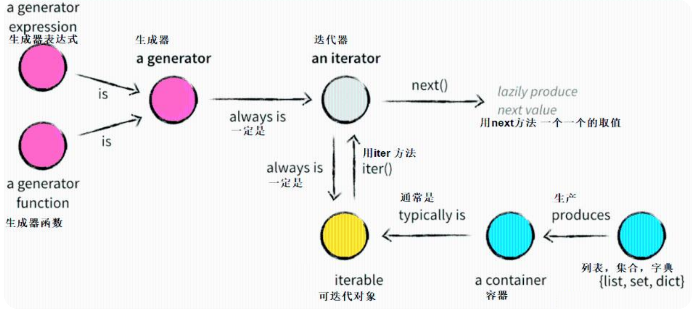

### for循环本质

for循环本质上就是通过不断调用 next\(\) 函数实现。

```Python
for i in [1, 2, 3]:
    pass
    
# 本质如下：
# 首先获得Iterator对象:
it = iter([1, 2, 3, 4, 5])
# 循环:
while True:
    try:
         # 获得下一个值:
         x = next(it)
    except StopIteration:
         # 遇到StopIteration就退出循环
         break
```

### 创建迭代器

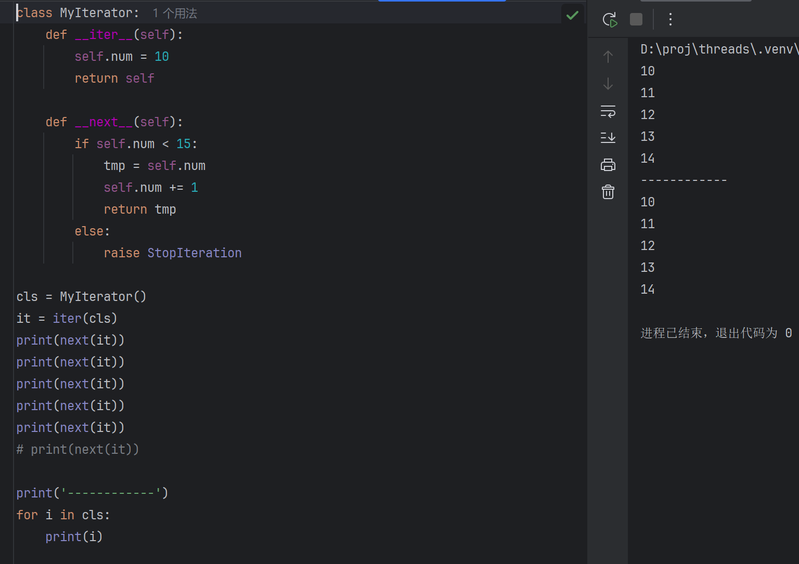

## 动态添加属性和方法

动态编程语言是高级程序设计语言的一个类别，在计算机科学领域已被广泛应用。

它是指在运行时可以改变其结构的语言 ：例如新的函数、 对象、甚至代码可以被引进， 已有的函数可以被删除或是其他结构上的变化。

1. 运行过程中给对象、类添加实例属性和实例方法

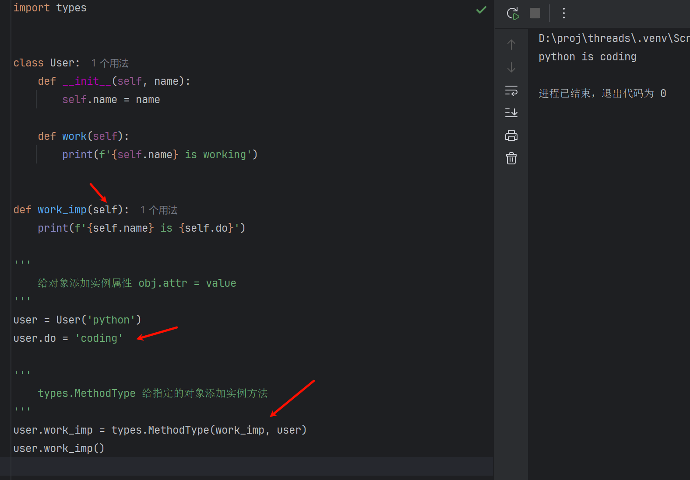

2. 给类动态添加静态方法以及类方法

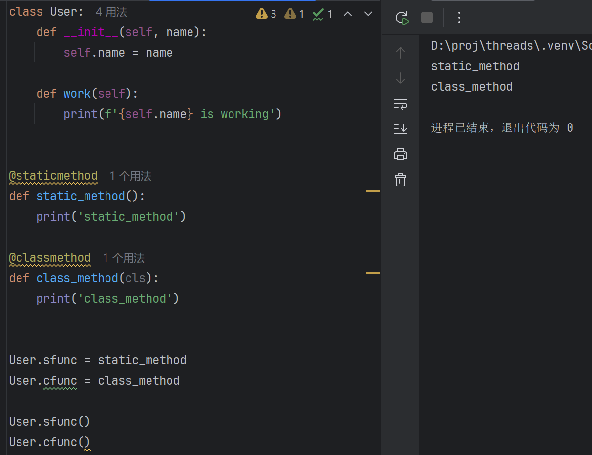

3. `__slots__` 限制添加

> - `__slots__` 对动态添加成员变量、成员方法有限制。对动态添加类属性、类方法没有限制。 
> 
> - \_\_slots\_\_ 只对本类有限制，不限制子类
> 
> 

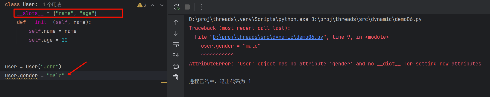

# python新特性

## formatted字符串字面值和新增方法

`formatted`字符串是带有`'f'`字符前缀的字符串，可以很方便的格式化字符串

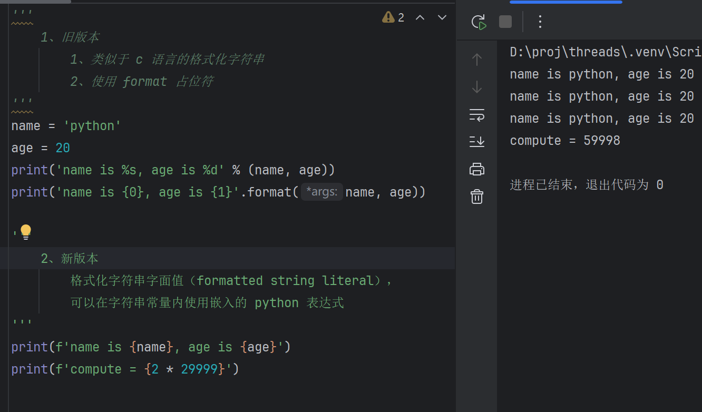

- formatted字符串支持 =

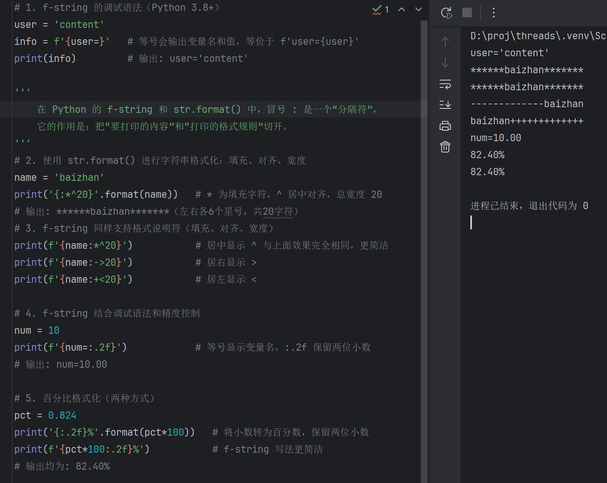

- 字符串新增方法

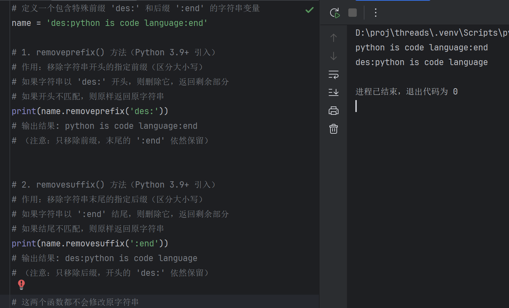

## 变量类型标注

变量类型注解是用来对变量和函数的参数返回值类型做注解，帮助开发者写出更加严谨的代码，让调用方减少类型方面的错误，也可以提高代码的可读性和易用性。

Python 中的变量类型标注（Type Hints）对变量赋值没有任何运行时的限制，它仅仅是“标注”（也就是注释/提示）。所以，即使和标注的类型不同也可以被赋值，执行使用时也没有问题。

虽然 Python 运行时忽略它，但它在开发中非常重要：

- IDE 智能提示：PyCharm、VSCode 等编辑器会根据你的标注，增加警告波浪线提示标注和类型和赋值的类型不一致。

- 静态类型检查器：可以安装第三方工具（如 mypy、pylint、pyright）来扫描你的代码。如果代码中写了 `age: int = "hello"`，mypy 会在运行前给你发出红线警告，但这需要你主动手动运行检查工具，Python 本身不会管。

**常用数据类型如下：**

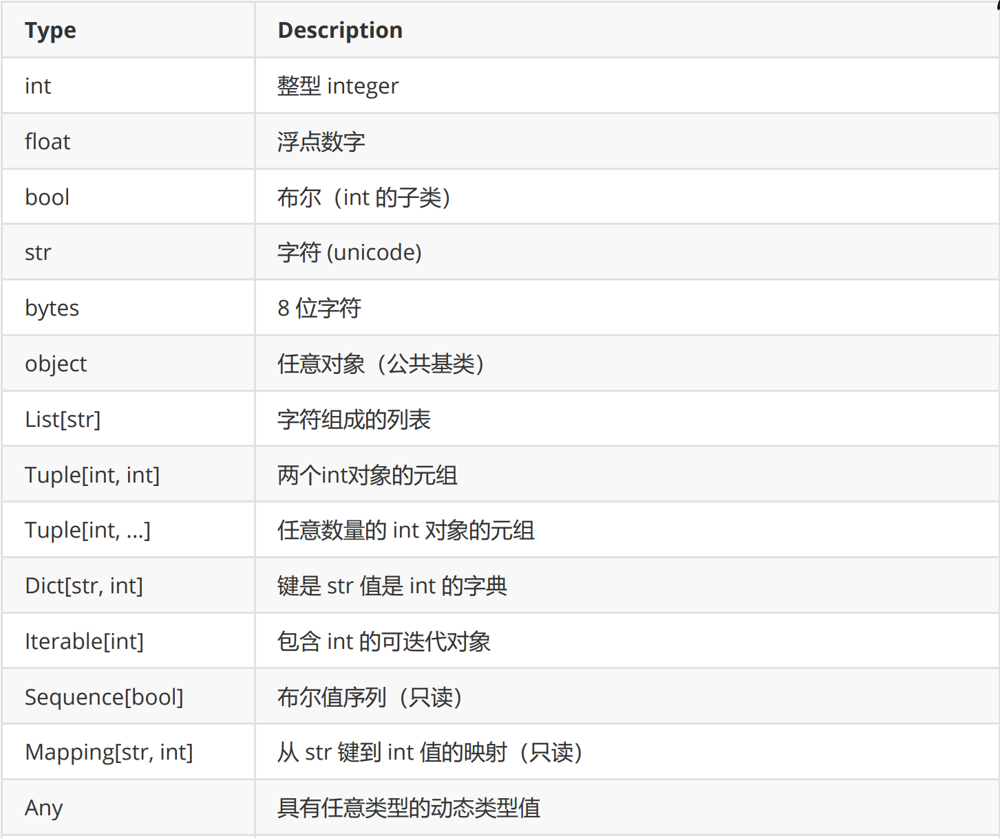

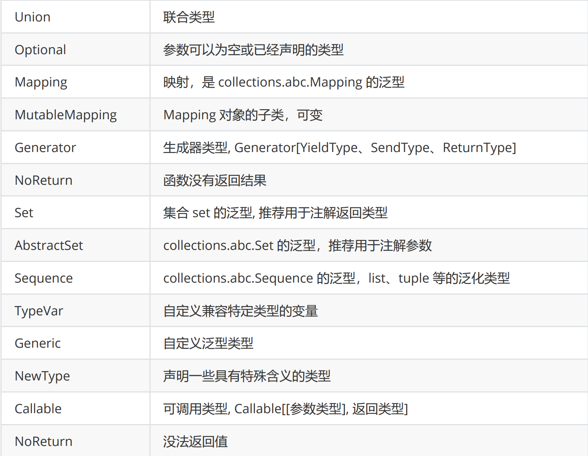

### 简单数据类型标注

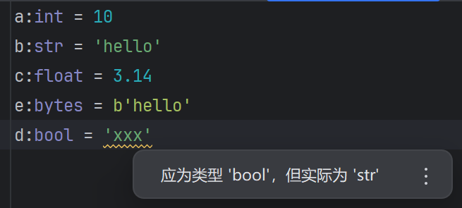

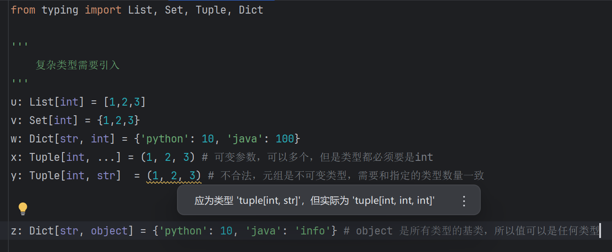

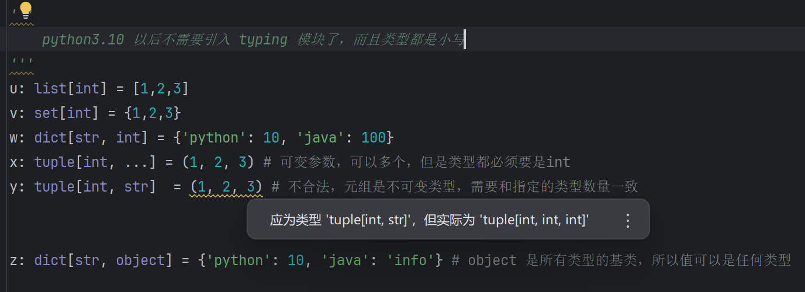

### 函数参数、返回值添加类型标注

```Python
# 1. 基本参数和返回值标注
def stringify(num: int) -> str:
    return str(num)

# 2. 多参数标注
def plus(num1: int, num2: int) -> int:
    return num1 + num2

# 3. 带默认值的参数：默认值类型应与标注一致
def plus2(num1: int, num2: float = 99.0) -> float:
    return num1 + num2

# 4. 返回元组：使用 tuple[类型1, 类型2]（Python 3.9+）
def f(name: str, age: int) -> tuple[str, int]:
    return f'{name=}', age

# 5. Callable 标注：参数列表是扁平列表，如 [[str, int], 返回值] 为错误写法
from typing import Callable
func: Callable[[str, int], tuple[str, int]] = f

# 6. 生成器返回 Iterator[类型]，实际用 yield
from typing import Iterator
def g(n: int) -> Iterator[int]:
    i = 0
    while i < n:
        yield i
        i += 1
```

### 混合类型检查改进

```Python
from typing import Union

# Union 是 typing 模块中的类型提示，表示"可以是多种类型中的一种"
# Union[int, float] 表示参数或返回值可以是 int 或 float 类型
# 这是 Python 3.9 及更早版本的写法（需要导入 Union）
def old_func(param: Union[int, float]) -> Union[int, float]:
    return param ** 2

print(old_func(12.0))   # 输出 144.0


# Python 3.10+ 支持用 | 语法，更简洁，无需导入 Union
def new_func(param: int | float) -> int | float:
    return param ** 2

print(new_func(12.0))   # 输出 144.0
```

### 类型别名更改

之前是直接通过不同类型的赋值操作来赋予类型新的名字，在新版本中通过TypeAlias来规定了类型名字的替换。这样操作的优势在于能够让程序开发人员和Python编辑器更加清楚的知道newname是一个变量名还是一个类型的别名，提升程序开发的可靠性。

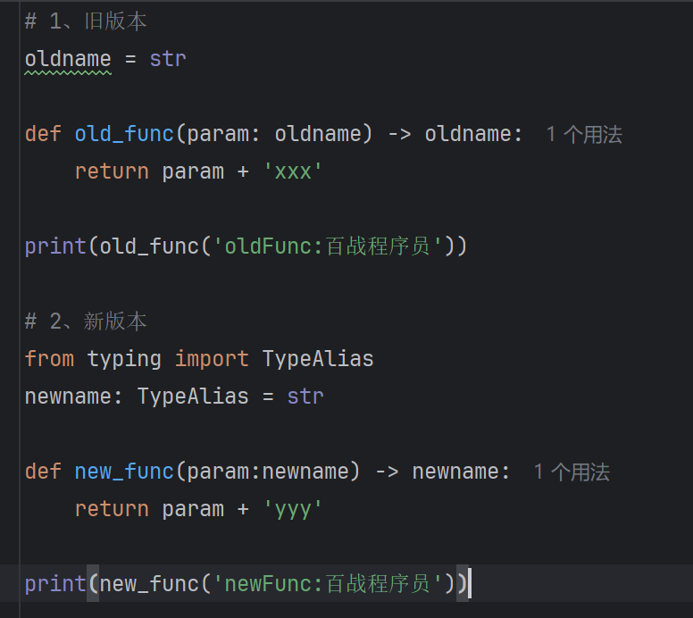

## 二进制表示中频率为1的数量统计

通过调用`bit_count`函数来统计二进制中数字`"1"`的个数。

```Python
num = 10

# 1、旧版本
print(bin(num))
print('出现1的次数 =', bin(num).count('1'))

# 2、新版本
print(num.bit_count())
```

## 字典新特性

### 字段的三个方法新增 mapping 属性

在Python3\.10中，针对于字典的三个方法，`items，keys，和 values`都增加了一mapping属性，通过上诉的程序可以发现，对三个方法调用`mapping`属性后都会返回原字典数据。

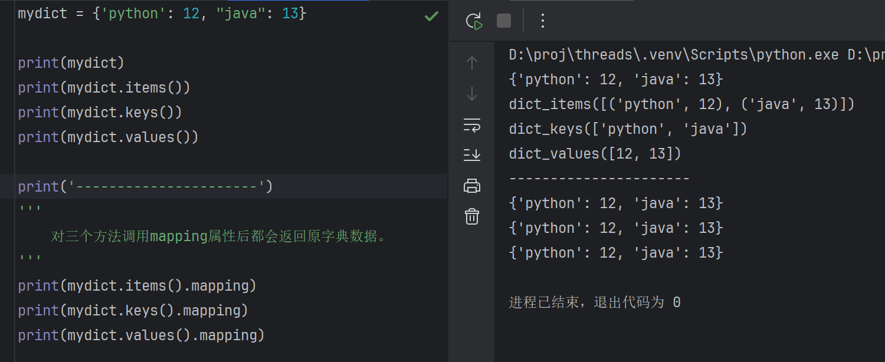

### 函数 zip 新增 strict 参数

`zip()` 是 Python 内置函数，核心作用是将多个可迭代对象（如列表、元组、字符串）按索引位置一一配对，打包成元组组成的迭代器。

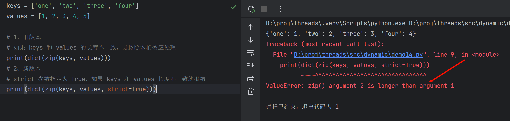

### 字典合并

字典添加了两个新的运算符：`|` 和 `|=` 。\| 运算符用于合并字典。\|= 用于更新字典。

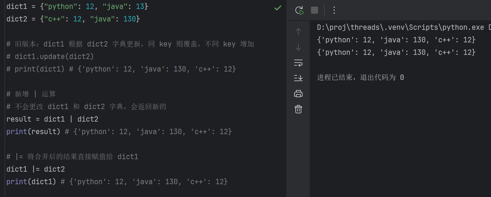

## match语法

`match...case`结构化模式匹配，可以匹配字典、类以及其他更复杂的结构。`match...case`的匹配模式匹配于Java或C\+\+中的switch的使用很相似。

```Python
*'''*
*match subject:*
*   case <pattern_1>:*
*       <action_1>*
*   case <pattern_2>:*
*       <action_2>*
*   case <pattern_3>:*
*       <action_3>*
*   case _:*
*       <action_wildcard>*
*'''*
```

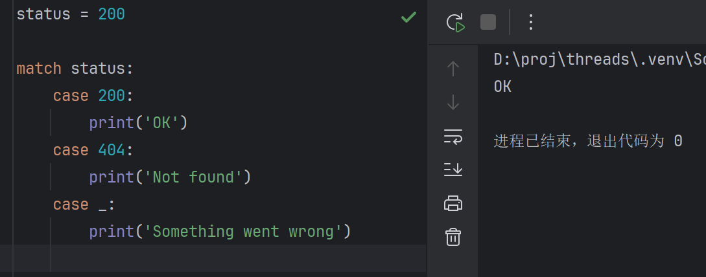

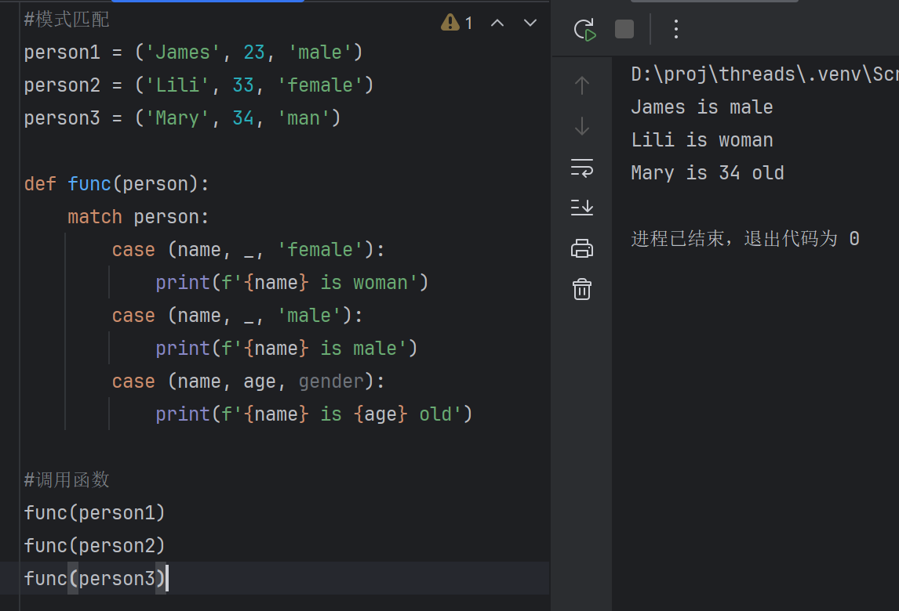

## dataclass

dataclass 可以认为是提供了一个简写 \_\_init\_\_ 方法的语法糖，类型注释是必填项 \(不限制数据类型时, 添加typing\.Any为类型注释\), 默认 值的传递方式和 **init** 方法的参数格式一致。

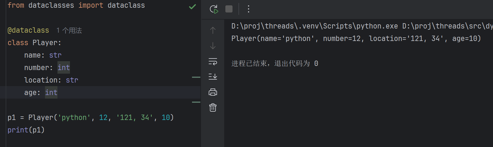

1. dataclass装饰器上的参数

dataclass装饰器将根据类属性生成数据类和数据类需要的方法。

```Python
dataclasses.dataclass(*, init=True, repr=True, eq=True, 
                         order=False, unsafe_hash=False, 
                         frozen=False)
```

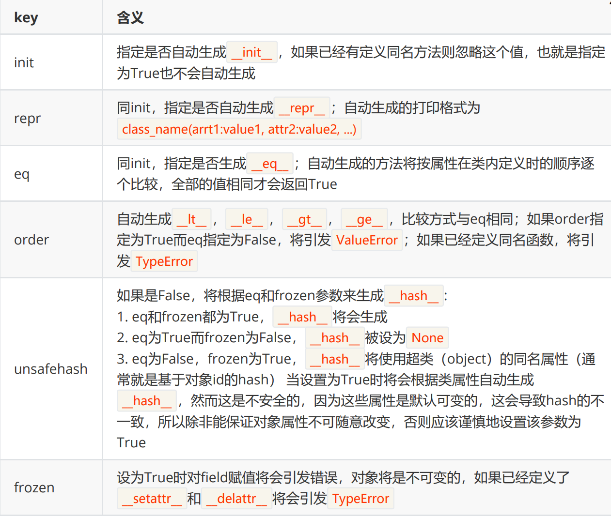

2. dataclass成员变量额外设置

> - default：设置默认值，值为具体的值
> 
> - default\_factory：设置默认值，职位类型名，程序会根据类型名创建一个空对象，若使用 default 设置需要手动创建空对象
> 
> - repr设置生成的 \_\_repr\_\_ 方法中是否加入此属性，默认为 True
> 
> 

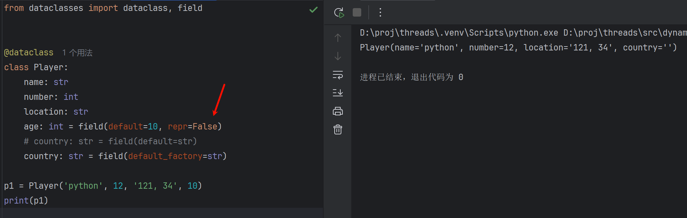

3. dataclass建立类变量

在类中建立变量，默认是成员变量，若需要设置类变量，需要设置类型为： `ClassVar`

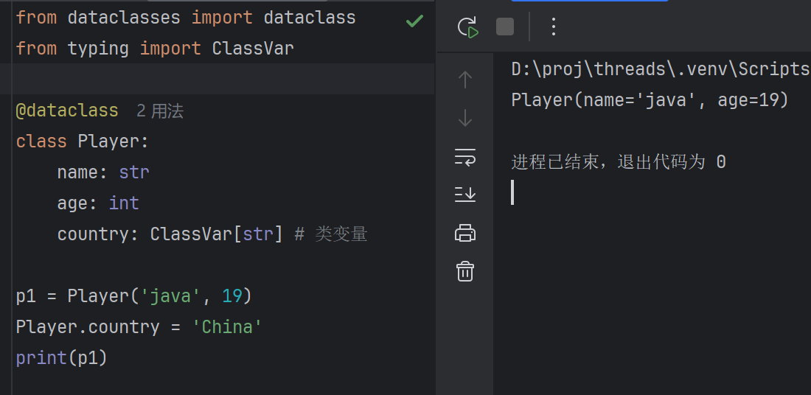

# python内存管理机制


